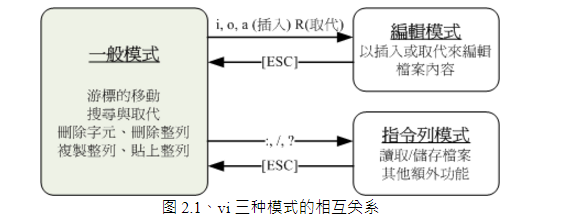

# Vim 编辑器
>

## 1\. Vim的介绍

### 1\.1 vim的模式
vim 共有三种模式，分别是：一般模式、编辑模式、命令模式
* 一般模式

以 vi 打开一个档案就直接进入一般模式了\(这是默认的模式\)。在这个模式中， 你可以使用『上下左右』按键来移动光标，你可以使用『删除字符』或『删除整行』来处理档案内容， 也可以使用『复制、贴上』来处理你的文件数据。
* 编辑模式

在一般模式中可以进行删除、复制、贴上等等的动作，但是却无法编辑文件内容的！ 要等到你按下『i, I, o, O, a, A, r, R』等任何一个字母之后才会进入编辑模式。注意了！通常在 Linux 中，按下这些按键时，在画面的左下方会出现『 INSERT 或 REPLACE 』的字样，此时才可以进行编辑。而如果要回到一般模式时， 则必须要按下『Esc』这个按键即可退出编辑模式。
* 命令模式

在一般模式当中，输入『 \: \/ \? 』三个中的任何一个按钮，就可以将光标移动到最底下那一行。在这个模式当中， 可以提供你『搜寻资料』的动作，而读取、存盘、大量取代字符、离开 vi 、显示行号等等的动作则是在此模式中达成的！
简单的说，我们可以将这三个模式想成底下的图标来表示

### 1\.2 Vim的按键说明
##### 1\.2\.1 一般模式

<table>
<tr><td colspan="2">移动光标的方法</td></tr>
<tr><td>h 或 向左箭头键(←)</td><td>光标向左移动一个字符</td></tr>
<tr><td>j 或 向下箭头键(↓)</td><td>光标向下移动一个字符</td></tr>
<tr><td>k 或 向上箭头键(↑)</td><td>光标向上移动一个字符</td></tr>
<tr><td>l 或 向右箭头键(→)</td><td>光标向右移动一个字符</td></tr>
<tr><td>[Ctrl] + [f]</td><td>屏幕『向下』移动一页，相当于 [Page Down]按键 (常用)</td></tr>
<tr><td>[Ctrl] + [b]</td><td>屏幕『向上』移动一页，相当于 [Page Up] 按键 (常用)</td></tr>
<tr><td>[Ctrl] + [d]</td><td>屏幕『向下』移动半页</td></tr>
<tr><td>[Ctrl] + [u]</td><td>屏幕『向上』移动半页</td></tr>
<tr><td>n&lt;space&gt;</td><td>那个 n 表示『数字』，例如 20 。按下数字后再按空格键，光标会向右移动这一行的 n 个字符。例如 20<space> 则光标会向后面移动 20 个字符距离。</td></tr>
<tr><td>0 或功能键[Home]</td><td>这是数字『 0 』：移动到这一行的最前面字符处 (常用)</td></tr>
<tr><td>$ 或功能键[End]</td><td>移动到这一行的最后面字符处(常用)</td></tr>
<tr><td>H</td><td>光标移动到这个屏幕的最上方那一行的第一个字符</td></tr>
<tr><td>M</td><td>光标移动到这个屏幕的中央那一行的第一个字符</td></tr>
<tr><td>L</td><td>光标移动到这个屏幕的最下方那一行的第一个字符</td></tr>
<tr><td>G</td><td>移动到这个档案的最后一行(常用)</td></tr>
<tr><td>nG</td><td>n 为数字。移动到这个档案的第 n 行。例如 20G 则会移动到这个档案的第 20 行(可配合 :set nu)</td></tr>
<tr><td>gg</td><td>移动到这个档案的第一行，相当于 1G 啊！ (常用)</td></tr>
<tr><td>n&lt;Enter&gt;</td><td>n 为数字。光标向下移动 n 行(常用)</td></tr>
<tr><td colspan="2">搜索与替换</td></tr>
<tr><td>/word</td><td>向光标之下寻找一个名称为 word 的字符串。例如要在档案内搜寻 vbird 这个字符串，就输入 /vbird 即可！ (常用)</td></tr>
<tr><td>?word</td><td>向光标之上寻找一个字符串名称为 word 的字符串。</td></tr>
<tr><td>n</td><td>这个 n 是英文按键。代表『重复前一个搜寻的动作』。举例来说， 如果刚刚我们执行 /vbird 去向下搜寻 vbird 这个字符串，则按下 n 后，会向下继续搜寻下一个名称为 vbird 的字符串。如果是执行 ?vbird 的话，那么按下 n 则会向上继续搜寻名称为 vbird 的字符串！</td></tr>
<tr><td>N</td><td>这个 N 是英文按键。与 n 刚好相反，为『反向』进行前一个搜寻动作。 例如 /vbird 后，按下 N 则表示『向上』搜寻 vbird 。</td></tr>
<tr><td>:n1,n2s/word1/word2/g</td><td>n1 与 n2 为数字。在第 n1 与 n2 行之间寻找 word1 这个字符串，并将该字符串取代为 word2 ！举例来说，在 100 到 200 行之间搜寻 vbird 并取代为 VBIRD 则：『:100,200s/vbird/VBIRD/g』。(常用)</td></tr>
<tr><td>:1,$s/word1/word2/g</td><td>从第一行到最后一行寻找 word1 字符串，并将该字符串取代为 word2 ！(常用)</td></tr>
<tr><td>:1,$s/word1/word2/gc</td><td>从第一行到最后一行寻找 word1 字符串，并将该字符串取代为 word2 ！且在取代前显示提示字符给用户确认 (confirm) 是否需要取代！(常用)</td></tr>
<tr><td colspan="2">删除、复制与粘贴</td></tr>
<tr><td>x,X</td><td>在一行字当中，x 为向后删除一个字符 (相当于 [del] 按键)， X 为向前删除一个字符(相当于 [backspace] 亦即是退格键) (常用)</td></tr>
<tr><td>nx</td><td>n 为数字，连续向后删除 n 个字符。举例来说，我要连续删除 10 个字符，『10x』。</td></tr>
<tr><td>dd</td><td>删除游标所在的那一整列(常用)</td></tr>
<tr><td>ndd</td><td>n 为数字。删除光标所在的向下 n 列，例如 20dd 则是删除 20 列 (常用)</td></tr>
<tr><td>d1G</td><td>删除光标所在到第一行的所有数据</td></tr>
<tr><td>dG</td><td>删除光标所在到最后一行的所有数据</td></tr>
<tr><td>d$</td><td>删除游标所在处，到该行的最后一个字符</td></tr>
<tr><td>d0</td><td>那个是数字的0，删除游标所在处，到该行的最前面一个字符</td></tr>
<tr><td>yy</td><td>复制游标所在的那一行(常用)</td></tr>
<tr><td>nyy</td><td>n 为数字。复制光标所在的向下 n 列，例如 20yy 则是复制 20 列(常用)</td></tr>
<tr><td>y1G</td><td>复制光标所在的那个字符到该行行首的所有数据</td></tr>
<tr><td>yG</td><td>复制光标所在的那个字符到该行行尾的所有数据</td></tr>
<tr><td>y0</td><td>复制光标所在的那个字符到该行行首的所有数据</td></tr>
<tr><td>y$</td><td>复制光标所在的那个字符到该行行尾的所有数据</td></tr>
<tr><td>p,P</td><td>p 为将已复制的数据在光标下一行贴上，P 则为贴在游标上一行！ 举例来说，我目前光标在第 20 行，且已经复制了 10 行数据。则按下 p 后， 那 10 行数据会贴在原本的 20 行之后，亦即由 21 行开始贴。但如果是按下 P 呢？ 那么原本的第 20 行会被推到变成 30 行。 (常用)</td></tr>
<tr><td>J</td><td>将光标所在列与下一列的数据结合成同一列</td></tr>
<tr><td>c</td><td>重复删除多个数据，例如向下删除 10 行，[ 10cj ]</td></tr>
<tr><td>u</td><td>复原前一个动作。(常用)</td></tr>
<tr><td>[Ctrl]+r</td><td>重做上一个动作。(常用)。u 与 [Ctrl]+r 是很常用的指令！一个是复原，另一个则是重做一次～ 利用这两个功能按键，你的编辑，嘿嘿！很快乐的啦！</td></tr>
<tr><td>.</td><td>不要怀疑！这就是小数点！意思是重复前一个动作的意思。 如果你想要重复删除、重复贴上等等动作，按下小数点『.』就好了！ (常用)</td></tr>
</table>

##### 1\.2\.2 一般模式切换到编辑模式的可用的按钮说明
<table>
<tr><td colspan="2">进入插入或取代的编辑模式</td></tr>
<tr><td>i, I</td><td>进入插入模式(Insert mode)：i 为『从目前光标所在处插入』， I 为『在目前所在行的第一个非空格符处开始插入』。 (常用)</td></tr>
<tr><td>a, A</td><td>进入插入模式(Insert mode)：a 为『从目前光标所在的下一个字符处开始插入』， A 为『从光标所在行的最后一个字符处开始插入』。(常用)</td></tr>
<tr><td>o, O</td><td>进入插入模式(Insert mode)：这是英文字母 o 的大小写。o 为『在目前光标所在的下一行处插入新的一行』； O 为在目前光标所在处的上一行插入新的一行！(常用)</td></tr>
<tr><td>r, R</td><td>进入取代模式(Replace mode)：r 只会取代光标所在的那一个字符一次；R会一直取代光标所在的文字，直到按下 ESC 为止；(常用)</td></tr>
<tr><td>[Esc]</td><td>退出编辑模式，回到一般模式中(常用)</td></tr>
</table>

##### 1\.2\.3 一般模式切换到指令模式的可用的按钮说明
<table>
<tr><td colspan="2">指令列的储存、离开等指令</td></tr>
<tr><td>:w</td><td>将编辑的数据写入硬盘档案中(常用)</td></tr>
<tr><td>:w!</td><td>若文件属性为『只读』时，强制写入该档案。不过，到底能不能写入， 还是跟你对该档案的档案权限有关啊！</td></tr>
<tr><td>:q</td><td>离开 vi (常用)</td></tr>
<tr><td>:q!</td><td>若曾修改过档案，又不想储存，使用 ! 为强制离开不储存档案。</td></tr>
<tr><td>:wq</td><td>储存后离开，若为 :wq! 则为强制储存后离开 (常用)</td></tr>
<tr><td>ZZ</td><td>这是大写的 Z 喔！若档案没有更动，则不储存离开，若档案已经被更动过，则储存后离开！</td></tr>
<tr><td>:w [filename]</td><td>将编辑的数据储存成另一个档案（类似另存新档）</td></tr>
<tr><td>:r [filename]</td><td>在编辑的数据中，读入另一个档案的数据。亦即将 『filename』 这个档案内容加到游标所在行后面</td></tr>
<tr><td>:n1,n2 w [filename]</td><td>将 n1 到 n2 的内容储存成 filename 这个档案。</td></tr>
<tr><td>:! command</td><td>暂时离开 vi 到指令列模式下执行 command 的显示结果！例如
                           『:! ls /home』即可在 vi 当中察看 /home 底下以 ls 输出的档案信息！</td></tr>
<tr><td colspan="2">vim 环境的变更</td></tr>
<tr><td>:set nu</td><td>显示行号，设定之后，会在每一行的前缀显示该行的行号</td></tr>
<tr><td>:set nonu</td><td>与 set nu 相反，为取消行号！</td></tr>
</table>

**特别注意**：在 vi 中，『数字』是很有意义的！数字通常代表重复做几次的意思！ 也有可能是代表去到第几个什么什么的意思。举例来说，要删除 50 行，则是用 『50dd』 对吧！ 数字加在动作之前～那我要向下移动 20 行呢？那就是『20j』或者是『20↓』即可。