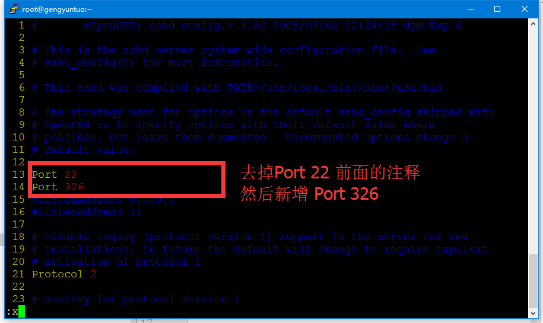
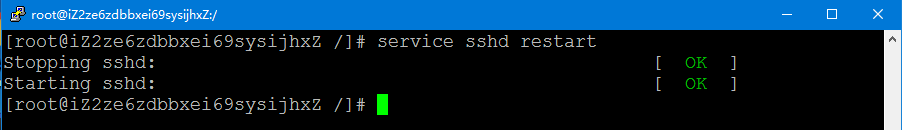

# 修改Linux SSH端口
>

## 修改SSH端口
1. 编辑`/etc/ssh/sshd_config`文件：

注意是sshd_config 而不是ssh_config



**注意**：修改时要保留22端口，防止因修改失败而导致无法通过SSH方式登录到系统。

2. 重启ssh服务
```shell
service sshd restart
```



3. 使用新的端口登录Linux，如果登录成功则可以将ssh配置文件中的22端口注释掉，然后重启ssh服务，这样的话就仅能够使用新配置的端口登录Linux了。

**注意**：如果无法通过新的端口登录到Linux，可能是因为防火墙的问题。[开放端口](./Book000-22-OpenPort.md)