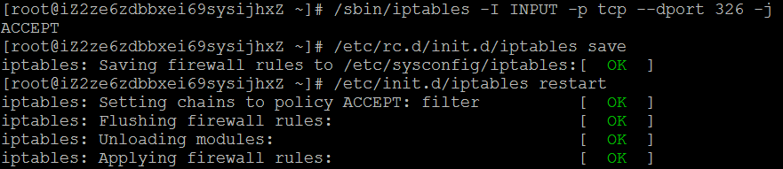

# 开放Linux端口
>

## 命令行方式
1. 开放端口命令：`/sbin/iptables -I INPUT -p tcp --dport [端口号] -j ACCEPT`
2. 保存：`/etc/rc.d/init.d/iptables save`
3. 重启服务：`/etc/init.d/iptables restart`
4. 查看端口是否开放：`/sbin/iptables -L -n`

如图：



##  修改`/etc/sysconfig/iptables`
在文件中添加如下内容
```
-A INPUT -p tcp -m state --state NEW -m tcp --dport 22 -j ACCEPT
```

## 重新启动iptables
```
service iptables restart
```