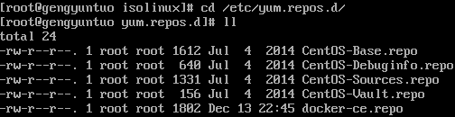

# LINUX 配置本地yum源的方法
>

# Yum 安装
yum 的基础安装包包括：
* `yum` //RPM installer/updater
* `yum-fastestmirror` //Yum plugin which chooses fastest repository from a mirrorlist
* `yum-metadata-parser` //A fast metadata parser for yum

# Yum 配置
yum 的配置文件分为两部分：main 和repository
* main 部分定义了全局配置选项，整个yum 配置文件应该只有一个main。常位于`/etc/yum.conf`中。
* repository 部分定义了每个源/服务器的具体配置，可以有一到多个。常位于`/etc/yum.repo.d`目录下的各文件中。

yum.conf 文件一般位于`/etc`目录下，一般其中只包含main部分的配置选项。

```
[main]

# yum 缓存的目录，yum 在此存储下载的rpm 包和数据库，默认设置为/var/cache/yum
cachedir=/var/cache/yum

# 安装完成后是否保留软件包，0为不保留（默认为0），1为保留
keepcache=0

# Debug 信息输出等级，范围为0-10，缺省为2
debuglevel=2

# yum 日志文件位置。用户可以到/var/log/yum.log 文件去查询过去所做的更新。
logfile=/var/log/yum.log

# 包的策略。一共有两个选项，newest 和last，这个作用是如果你设置了多个repository，而同一软件在不同的repository 中同时存在，yum 应该安装哪一个，如果是newest，则yum 会安装最新的那个版本。如果是last，则yum 会将服务器id 以字母表排序，并选择最后的那个服务器上的软件安装。一般都是选newest。
pkgpolicy=newest

# 指定一个软件包，yum 会根据这个包判断你的发行版本，默认是redhat-release，也可以是安装的任何针对自己发行版的rpm包。
distroverpkg=redhat-release

# 有1和0两个选项，表示yum 是否容忍命令行发生与软件包有关的错误，比如你要安装1,2,3三个包，而其中3此前已经安装了，如果你设为1,则yum 不会出现错误信息。默认是0。
tolerant=1

# 有1和0两个选项，设置为1，则yum 只会安装和系统架构匹配的软件包，例如，yum 不会将i686的软件包安装在适合i386的系统中。默认为1。
exactarch=1

# 网络连接发生错误后的重试次数，如果设为0，则会无限重试。默认值为6.
retries=6

# 这是一个update 的参数，具体请参阅yum(8)，简单的说就是相当于upgrade，允许更新陈旧的RPM包。
obsoletes=1

# 是否启用插件，默认1为允许，0表示不允许。我们一般会用yum-fastestmirror这个插件。
plugins=1

bugtracker_url=http://bugs.centos.org/set_project.php?project_id=16&ref=http://bugs.centos.org/bug_report_page.php?category=yum

# Note: yum-RHN-plugin doesn't honor this.
metadata_expire=1h

installonly_limit = 5

# PUT YOUR REPOS HERE OR IN separate files named file.repo
# in /etc/yum.repos.d
```
除了上述之外，还有一些可以添加的选项，如：
* `exclude=selinux*`：排除某些软件在升级名单之外，可以用通配符，列表中各个项目要用空格隔开，这个对于安装了诸如美化包，中文补丁的朋友特别有用。
* `gpgcheck=1`：有1和0两个选择，分别代表是否是否进行gpg\(GNU Private Guard\) 校验，以确定rpm包的来源是有效和安全的。这个选项如果设置在`[main]`部分，则对每个repository都有效。默认值为0。

# 配置本地yum源
1. 挂载系统安装光盘
   ```
   # mount /dev/cdrom /mnt/cdrom/
   ```
2. 配置本地yum源
   ```
   # cd /etc/yum.repos.d/
   # ls
   ```
   运行结果如图：  
   
   以上repo文件，分别是：
   * `CentOS-Base.repo`是yum网络源的配置文件
   * `CentOS-Media.repo`是yum本地源的配置文件
   修改`CentOS-Media.repo`
   ```
   # CentOS-Media.repo
   #
   # This repo is used to mount the default locations for a CDROM / DVD on
   #  CentOS-5.  You can use this repo and yum to install items directly off the
   #  DVD ISO that we release.
   #
   # To use this repo, put in your DVD and use it with the other repos too:
   #  yum --enablerepo=c5-media [command]
   #  
   # or for ONLY the media repo, do this:
   #
   #  yum --disablerepo=\* --enablerepo=c5-media [command]
    
   [c5-media]
   name=CentOS-$releasever - Media
   baseurl=file:///media/CentOS/
           file:///mnt/cdrom/
           file:///media/cdrecorder/
   gpgcheck=1
   enabled=1
   gpgkey=file:///etc/pki/rpm-gpg/RPM-GPG-KEY-CentOS-5
   ```
   在baseurl中修改第2个路径为`/mnt/cdrom`（即为光盘挂载点）
3. 禁用默认的yum网络源
   将yum网络源配置文件改名为`CentOS-Base.repo.bak`，否则会先在网络源中寻找适合的包，改名之后直接从本地源读取。
4. 完成

# 关于repo文件的格式
所有repository 服务器设置都应该遵循如下格式：
```
[serverid]
name=Some name for this server
baseurl=url://path/to/repository/
```
* serverid是用于区别各个不同的repository，必须有一个独一无二的名称；
* name是对repository 的描述，支持像`$releasever`、`$basearch`这样的变量；
* baseurl是服务器设置中最重要的部分，只有设置正确，才能从上面获取软件。它的格式是：
  ```
  baseurl=url://server1/path/to/repository/
  　　　　 url://server2/path/to/repository/
  　　　　 url://server3/path/to/repository/
  ```
  其中url支持的协议有`http://`、`ftp://`、`file://`三种。baseurl后可以跟多个url，你可以自己改为速度比较快的镜像站，但baseurl只能有一个，也就是说不能像如下格式：
  ```
  baseurl=url://server1/path/to/repository/
  baseurl=url://server2/path/to/repository/
  baseurl=url://server3/path/to/repository/
  ```
  其中url指向的目录必须是这个repository header目录的上一级，它也支持`$releasever`、`$basearch`这样的变量。url之后可以加上多个选项，如gpgcheck、exclude、failovermethod 等，比如：
  ```
  [updates-released]
  name=Fedora Core $releasever - $basearch - Released Updates
  baseurl=http://download.atrpms.net/mirrors/fedoracore/updates/$releasever/$basearch
  　　　　 http://redhat.linux.ee/pub/fedora/linux/core/updates/$releasever/$basearch
  　　　　 http://fr2.rpmfind.net/linux/fedora/core/updates/$releasever/$basearch
  gpgcheck=1
  exclude=gaim
  failovermethod=priority
  ```
  其中gpgcheck，exclude的含义和`[main]`部分相同，但只对此服务器起作用，failovermethode有两个选项roundrobin和priority，意思分别是有多个url可供选择时，yum选择的次序，roundrobin是随机选择，如果连接失败则使用下一个，依次循环，priority则根据url的次序从第一个开始。如果不指明，默认是roundrobin。

# 配置国内yum源
系统默认的yum源速度往往不尽人意，为了达到快速安装的目的，在这里修改yum源为国内源。

本例为配置上海交通大学yum源，修改`/etc/yum.repos.d/CentOS-Base.repo`为：
```
# CentOS-Base.repo
#
# The mirror system uses the connecting IP address of the client and the
# update status of each mirror to pick mirrors that are updated to and
# geographically close to the client.  You should use this for CentOS updates
# unless you are manually picking other mirrors.
#
# If the mirrorlist= does not work for you, as a fall back you can try the 
# remarked out baseurl= line instead.
#
#

[base]
name=CentOS-$releasever - Base
#mirrorlist=http://mirrorlist.centos.org/?release=$releasever&arch=$basearch&repo=os
baseurl=http://ftp.sjtu.edu.cn/centos/$releasever/os/$basearch/
gpgcheck=1
gpgkey=file:///etc/pki/rpm-gpg/RPM-GPG-KEY-CentOS-5

#released updates 
[updates]
name=CentOS-$releasever - Updates
#mirrorlist=http://mirrorlist.centos.org/?release=$releasever&arch=$basearch&repo=updates
baseurl=http://ftp.sjtu.edu.cn/centos/$releasever/updates/$basearch/
gpgcheck=1
gpgkey=file:///etc/pki/rpm-gpg/RPM-GPG-KEY-CentOS-5

#additional packages that may be useful
[extras]
name=CentOS-$releasever - Extras
#mirrorlist=http://mirrorlist.centos.org/?release=$releasever&arch=$basearch&repo=extras
baseurl=http://ftp.sjtu.edu.cn/centos/$releasever/extras/$basearch/
gpgcheck=1
gpgkey=file:///etc/pki/rpm-gpg/RPM-GPG-KEY-CentOS-5

#additional packages that extend functionality of existing packages
[centosplus]
name=CentOS-$releasever - Plus
#mirrorlist=http://mirrorlist.centos.org/?release=$releasever&arch=$basearch&repo=centosplus
baseurl=http://ftp.sjtu.edu.cn/centos/$releasever/centosplus/$basearch/
gpgcheck=1
enabled=0
gpgkey=file:///etc/pki/rpm-gpg/RPM-GPG-KEY-CentOS-5

#contrib - packages by Centos Users
[contrib]
name=CentOS-$releasever - Contrib
#mirrorlist=http://mirrorlist.centos.org/?release=$releasever&arch=$basearch&repo=contrib
baseurl=http://ftp.sjtu.edu.cn/centos/$releasever/contrib/$basearch/
gpgcheck=1
enabled=0
gpgkey=file:///etc/pki/rpm-gpg/RPM-GPG-KEY-CentOS-5
```
关于变量：
* `$releasever`：代表发行版的版本，从`[main]`部分的distroverpkg获取，如果没有，则根据redhat-release包进行判断。
* `$arch`：cpu体系，如i686,athlon等
* `$basearch`：cpu的基本体系组，如i686和athlon同属i386，alpha和alphaev6同属alpha。

导入GPG KEY：
yum可以使用gpg对包进行校验，确保下载包的完整性，所以我们先要到各个repository站点找到gpg key，一般都会放在首页的醒目位置，一些名字诸如RPM-GPG-KEY-CentOS-5之类的纯文本文件，把它们下载下来，然后用rpm --import RPM-GPG-KEY-CentOS-5 命令将key导入。
