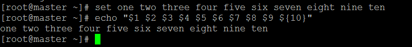

# 第5章 Shell编程基础
>

## 5\.1 Shell脚本的第一行“\#\!”（Shebang）

### 5\.4\.2 Bash内部变量
Bash内部变量

|变量名|变量说明|
|:----:|:------|
|`$BASH`|Bath实例的全路径|
|`$HOME`|当前用户的home目录|
|`$IFS`|IFS是内部字段分隔符的缩写。此变量决定当Bash解析字符串时将怎样识别字段，或单词分界线。默认为空格（空格、制表符和换行）|
|`$OSTYPE`|操作系统类型|
|`$SECONDS`|脚本运行时间|
|`$TMOUT`|该值非零时，此值被Bash用作read的默认超时秒数，如果在指定时间内没有输入，Bash将自动被终结|
|`$UID`|当前用户的账户标识码，与\/etc\/passwd中的记录相同。此变量记录的是当前账户的真是ID，及时通过su命令获得其他账户的权限。只读变量，不可修改。|

## 5\.4\.3 Bash中的位置参数和特殊参数
Bash中的位置参数是由除0以外的一个或多个数字表示的参数，可以使用set命令重新赋值。位置参数N可以被引用为`${N}`，或当N只含有一个数字时被引用为`$N`。

**注意**：位置参数不能用赋值语句赋值，而只能通过Bash的内部命令set和shift来设置和取消他们
当Shell运行时，位置参数会被临时的替换。

特殊参数

|参数名称|参数含义|
|:-----:|:------|
|`*`|所有的位置参数|
|`@`|所有的位置参数|
|`#`|位置参数的个数|
|`?`|最近一个执行的前台命令的退出状态|
|`-`|当前选项的标志|
|`$`|当前Shell的进程号|
|`!`|最近一次执行后台命令的进程号|
|`0`|扩展为Shell或者Shell脚本的名称|
|`_`|在Shell启动时，他被设为开始运行Shell或者Shell脚本的路径，随后，被设置为前一个命令的最后一个参数|

