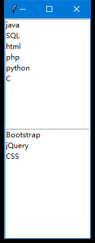

# Python GUI编程
>

## Python下的GUI库
* **Tkinter**：Tkinter 模块(Tk 接口)是 Python 的标准 Tk GUI 工具包的接口。
Tk 和 Tkinter 可以在大多数的 Unix 平台下使用，同样可以应用在 Windows 和 Macintosh 系统里。
Tk8.0 的后续版本可以实现本地窗口风格,并良好地运行在绝大多数平台中。
* **wxPython**：wxPython 是一款开源软件，是 Python 语言的一套优秀的 GUI 图形库，
允许 Python 程序员很方便的创建完整的、功能键全的 GUI 用户界面。
* **Jython**：Jython 程序可以和 Java 无缝集成。除了一些标准模块，Jython 使用 Java 的模块。
Jython 几乎拥有标准的Python 中不依赖于 C 语言的全部模块。比如，Jython 的用户界面将使用 Swing，
AWT或者 SWT。Jython 可以被动态或静态地编译成 Java 字节码。

## Tkinter 编程
> Tkinter是Python的标准GUI库。Python使用Tkinter可以快速的创建 GUI 应用程序。
  由于Tkinter是内置到python的安装包中、只要安装好Python之后就能导入Tkinter库，
  对于简单的图形界面 Tkinter 还是能应付自如。

**注意**：Python3\.x 版本使用的库名为`tkinter`，即首写字母T为小写。

##### 创建一个GUI程序
1.导入 Tkinter 模块
2.创建控件
3.指定这个控件的 master，即这个控件属于哪一个
4.告诉 GM(geometry manager) 有一个控件产生了。
```Python
#!/usr/bin/python
# -*- coding: UTF-8 -*-
import tkinter
top = tkinter.Tk()
# 进入消息循环
top.mainloop()
```

```Python
#!/usr/bin/python
# -*- coding: UTF-8 -*-

from tkinter import *           # 导入 tkinter 库
root = Tk()                     # 创建窗口对象的背景色
                                # 创建两个列表
list = ['C','python','php','html','SQL','java']
movie = ['CSS','jQuery','Bootstrap']
listComponent1 = Listbox(root)  #  创建列表组件
listComponent2 = Listbox(root)  #  创建列表组件
for item in list:               # 第一个小部件插入数据
    listComponent1.insert(0,item)

for item in movie:              # 第二个小部件插入数据
    listComponent2.insert(0,item)

listComponent1.pack()           # 将小部件放置到主窗口中
listComponent2.pack()
root.mainloop()                 # 进入消息循环
```
运行结果：



## tkinter组件
Tkinter的提供各种控件，如按钮、标签和文本框，一个GUI应用程序中使用。这些控件通常被称为控件或者部件。
目前有15种Tkinter的部件。我们提出这些部件以及一个简短的介绍，在下面的表：

|控件|描述|
|:----:|:----------|
|Button |按钮控件；在程序中显示按钮。|
|Canvas	|画布控件；显示图形元素如线条或文本|
|Checkbutton | 多选框控件；用于在程序中提供多项选择框|
|Entry |输入控件；用于显示简单的文本内容|
|Frame |框架控件；在屏幕上显示一个矩形区域，多用来作为容器|
|Label |标签控件；可以显示文本和位图|
|Listbox | 列表框控件；在Listbox窗口小部件是用来显示一个字符串列表给用户|
|Menubutton | 菜单按钮控件，由于显示菜单项。|
|Menu |菜单控件；显示菜单栏,下拉菜单和弹出菜单|
|Message | 消息控件；用来显示多行文本，与label比较类似|
|Radiobutton | 单选按钮控件；显示一个单选的按钮状态|
|Scale |范围控件；显示一个数值刻度，为输出限定范围的数字区间|
|Scrollbar | 滚动条控件，当内容超过可视化区域时使用，如列表框。.|
|Text |文本控件；用于显示多行文本|
|Toplevel | 容器控件；用来提供一个单独的对话框，和Frame比较类似|
|Spinbox | 输入控件；与Entry类似，但是可以指定输入范围值|
|PanedWindow | PanedWindow是一个窗口布局管理的插件，可以包含一个或者多个子控件。|
|LabelFrame | labelframe 是一个简单的容器控件。常用与复杂的窗口布局。|
|tkMessageBox | 用于显示你应用程序的消息框。|

