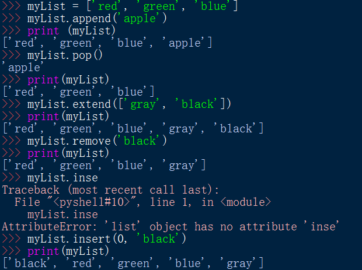
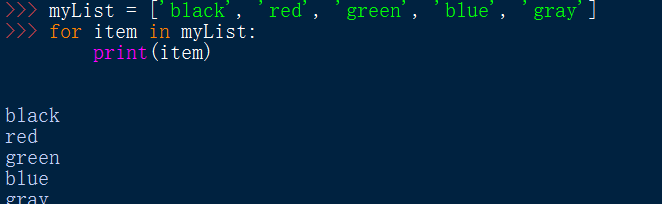
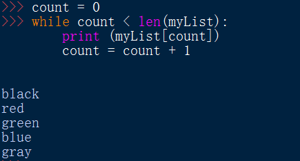
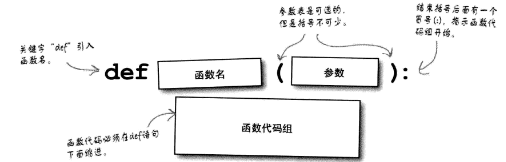

# 第一章 初始Python

# Python简介
不啰嗦了，总之Python很好。

# 安装Python
都安装了好多次了。。。  
用下面的命令查看Python的版本  
```python -V```

# 列表
* 定义
  ```
  ['abc', 'def', 'gh']
  ```
* 访问
  通过下标访问

* 列表方法
  * append 在列表末尾增加一个数据项
  * pop 删除列表末尾的一个数据项
  * extend 在列表末尾增加一个数据项集合
  * remove 在列表中找到并删除一个数据项
  * insert 在某个特定的位置前面增加一个数据项



* 列表中存放不同类型的数据
* 迭代访问列表  




# 查看Python BIF
```
// 查询所有内建函数
dir(__builtins__)
// 查看帮助信息
help(input)
```

# 定义函数
