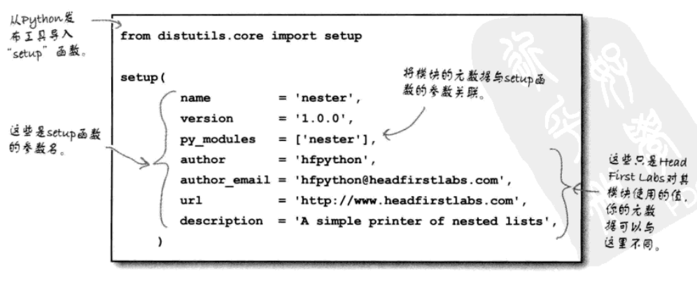
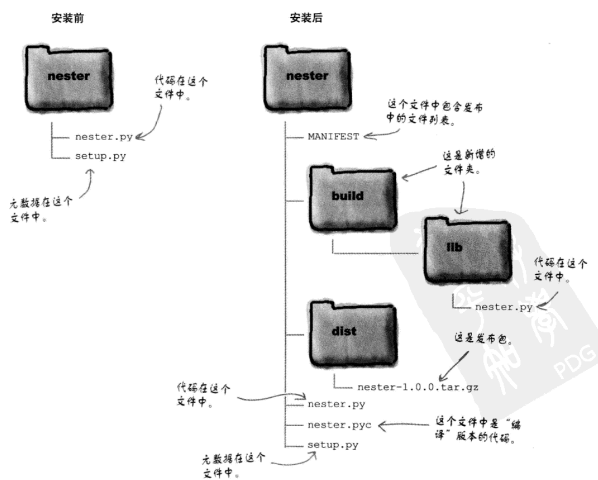

# 第二章 共享你的代码

## 函数转换为模块
模块就是一个包含Python代码的文件文件。对模块的主要需求就是要求文件名以`.py`结尾，这是Python扩展名。要把你的函数转换为一个模块，需要把代码保存到一个适当命名的文件中。

## 注释代码
为代码加注释绝对是一个好主意。计划向全世界分享你的模块时，如果有完善的注释，这对于建立文档很有帮助。  
在Python中，一个常用的注释技术是使用一个三重引号来建立多行注释。如果使用了一个三重引号，而没有将它赋至一个变量，三重引号之间所有内容都被认为是一个注释。

## 模块发布
* 创建一个文件夹，将模块文件存放到文件夹中，然后在文件夹中创建一个名为“setup.py”的文件。然后编辑这个文件，如下：
  
* 在新建的文件夹中打开终端窗口，然后运行如下命令，完成发布。
  ```
  python setup.py sdist
  ```
* 发布后，仍然在终端窗口，输入以下命令，将发布安装到你的Python本地副本中。
  ```
  python setup.py install
  ```

发布文件夹中的内容速览

