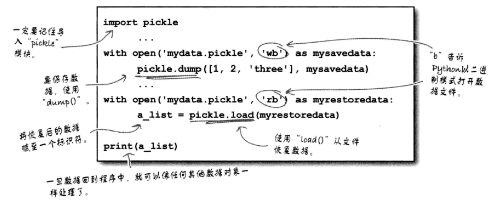

# 持久存储

## 异常处理（用Finally扩展）

**注意**：上图仍然会产生一个异常，通过str方法吧异常对象转换成字符串：

## BIF：locals（）
`locals()`：返回当前作用域中定义的变量名集合。

## 用with处理文件
由于处理文件时try/except/finally模式相当常用，所以Python提供了一个语句来抽象出相关的一些细节。对文件使用with语句时，可以大大减少需要编写的代码量，因为有了with语句就不再需要包含一个finally组来处理文件的关闭，即妥善关闭一个可能打开的数据文件。如下：

处理两个文件：  

## “腌制”数据
Python提供了一个标准库，名为pickle，它可以保存和加载几乎任何Python数据对象，包括列表。
* dump：保存数据
* load：恢复数据

**注意**：处理腌制数据时的唯一要求是，必须以二进制访问模式打开这些文件：

