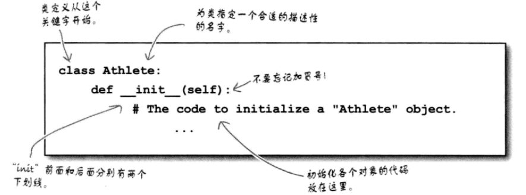
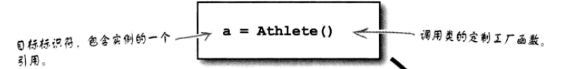
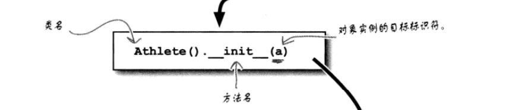
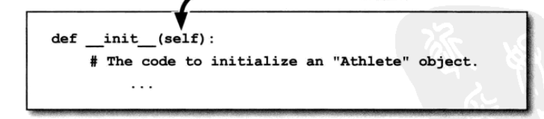
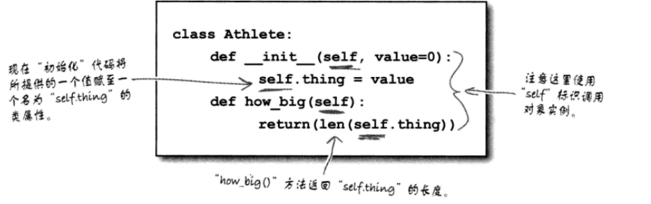
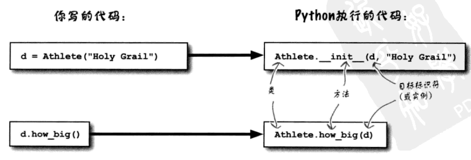
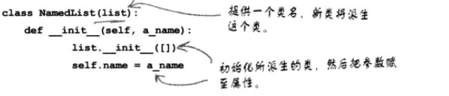

# 第六章 定制数据对象

## 类
Python使用class创建对象。每个定义的类都有一个特殊的方法，名为`__init__()`，可以通过这个方法控制如何初始化对象。  
类中的方法与函数的定义很相似，也就是说，同样使用def来定义。基本形式如下：

## self的重要性
**注意**：定义一个类时，实际上是在定义一个定制工厂函数，然后可以在你的代码中使用这个工厂函数创建实例：

Python处理这行代码时，它把工厂函数调用转换为以下调用，明确了类、方法（自动设置为`__init__()`）和所处理的对象实例：

下面再来看如何在类中定义`__init__()`方法：

**注意**：这是一个非常重要的参数赋值。如果没有这个赋值，Python解释器无法得出方法调用要应用到哪个对象实例。注意，类代码设计为在所有对象实例间共享：方法是共享的，而属性不共享。self参数可以帮助标识要处理哪个对象实例的数据。

## 每个方法的第一个参数都是*self*
Python要求每个方法的第一个参数为调用对象实例。下面扩展这个示例类，在一个名为thing的对象属性中存储一个值，具体值将在初始化时设置。另外还要扩充一个方法，名为how_big()，它会利用len() BIF返回thing的长度：

在一个对象实例上调用类方法时，Python要求第一个参数是调用对象实例，这往往赋至各方法的self参数。仅凭这一点就足以解释为什么self如此重要，也可以由此说明编写对象方法时为什么所有对象方法的第一个参数必须是self：

## 继承
