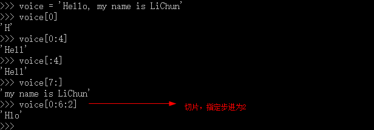

# Python
> * Python解释器
  * [Python程序文件](#python_program_file)

## Python 解释器
##### CPython
当我们从Python官方网站下载并安装好Python 3.5后，我们就直接获得了一个官方版本的解释器：CPython。这个解释器是用C语言开发的，所以叫CPython。在命令行下运行python就是启动CPython解释器。
CPython是使用最广的Python解释器。教程的所有代码也都在CPython下执行。

##### IPython
IPython是基于CPython之上的一个交互式解释器，也就是说，IPython只是在交互方式上有所增强，但是执行Python代码的功能和CPython是完全一样的。好比很多国产浏览器虽然外观不同，但内核其实都是调用了IE。
CPython用`>>>`作为提示符，而IPython用`In` \[序号\]\:作为提示符。

##### PyPy
PyPy是另一个Python解释器，它的目标是执行速度。PyPy采用JIT技术，对Python代码进行动态编译（注意不是解释），所以可以显著提高Python代码的执行速度。
绝大部分Python代码都可以在PyPy下运行，但是PyPy和CPython有一些是不同的，这就导致相同的Python代码在两种解释器下执行可能会有不同的结果。如果你的代码要放到PyPy下执行，就需要了解PyPy和CPython的不同点。

##### Jython
Jython是运行在Java平台上的Python解释器，可以直接把Python代码编译成Java字节码执行。

##### IronPython
IronPython和Jython类似，只不过IronPython是运行在微软\.Net平台上的Python解释器，可以直接把Python代码编译成\.Net的字节码。

### 小结

Python的解释器很多，但使用最广泛的还是CPython。如果要和Java或\.Net平台交互，最好的办法不是用Jython或IronPython，而是通过网络调用来交互，确保各程序之间的独立性。

### <a name="python_program_file" />Python程序文件
1. Python源程序文件通常以`.py`为扩展名

例如，新建一个名为first.py的文件，内容如下所示：
```
#!/usr/bin/python
import platform
print platform.uname()
```
* 第一行为shebang，即执行脚本时通知内容要启动的解释器
* 第二行通过import导入一个Python模块platform
* 第三行打印platform模块的uname方法的执行结果

2. Python程序课分解为模块、语句、表达式和对象

* 程序由模块构成
* 模块包含语句
* 语句包含表达式
* 表达式建立并处理对象

3. Python的最基本数据结构是序列
* 序列中的每个元素被分配一个序号——即元素的位置，也称为索引：索引从0开始编号
* Python包含6种内建的数据序列：列表、元组、字符串、Unicode字符串、buffer对象和xrange对象

4. Python的关键要素
* 基本数据类型
 * Integer 类型
   * 整型 ： 不可变类型
   * 布尔型
 * 浮点类型
   * 浮点数
   * 复数
     * 3\+6j
   * 十进制数字
   * 字符串
     * 属于序列，可以通过下标引用；是不可变类型
* 对象引用
  * 变量命名规则：
    * 只能包含字母、数字和下划线，且不能以数字开头
    * 区分字母大小写
    * 禁止使用保留字
      * Python2 和Python3 保留字不一样
  * 命名惯例：
    * 以单一下划线开发变量名\(`_x`\)不会被from module import \* 语句导入
    * 前后有下划线的变量名\(`__x__`\)是系统定义的变量名，对Python解释器有特殊的意义
    * 以两个下划线开头但结尾没有下划线的变量名\(`__x`\)是类的本地变量
    * 交互式模式下，变量名\(`_`\)用于保存最后的表达式的结果
  * **注意**：变量名没有类型，对象才有类型
* 组合数据类型
  * Python常用的组合数据类型
    * 序列类型
      * 列表：使用`[]`创建，可变对象
      * 元组：使用`()`创建，不可变对象
      * 字符串也属于序列类型，可以切片，如下图所示
      * 
    * 集合类型
      * 集合
    * 映射类型
      * 字典（类似说key-value键值对），是可变对象
* 逻辑操作符
  * 身份操作符
    * is : 判定左端对象引用是否等同于右端的对象引用
   * 比较操作符
     * `<`\,`>`\,`<=`\,`>=`\,`!=`\,`==`
* 控制流语句
  * `if`
    ```
      if boolean_expression_1 :
        suite_1
      elif boolean_expression_2 :
        suite_2
      ...
      else:
        else_suite
    ```
  * `while`
    ```
      while boolean_expression:
        suite
    ```
  * `for...in`
    ```
      for variable in iterable:
        suite
    ```
  * `try`
* 算数操作符
* 输入\/输出
  * 输出
    * `print` Python2中
    * `print ()` Python3中
    * **注意**：格式化显示的格式`print "String %format1 %format2 ... %(variable1,variable2, ...)`<br/>
  * 输入
    * `input`
    * `raw_input`
  * **注意**：Python解释器提供了3种标准文件对象，分别为标准输入、标准输出、标准错误，他们在sys模块中分别以`sys.stdin`、`sys.stdout`、`sys.stderr`形式提供
* 函数的创建与调用

5. Python的语句和语法
* 注释
  * `#`
* 续行
  * `\`\: 
  * `'''`\: 实现多行注释，文档注释，也可以当字符串的界定符
* 代码组
  * 缩进相同的一组语句构成的一个代码块
  * 首字以关键字开始，如if、while等，以冒号结束
  * Python使用缩进来分隔代码组，同一代码组的代码必须严格左对齐，否则会造成语法错误
* 同一行放置多个语句
  * \;\: 以分号作为分隔符
* 模块
  * 每一个Python脚本文件都可以被当成是一个模块
  * 模块里的代码可以是一段直接执行的脚本，也可以是一些类似库函数的代码从而可由别的模块执行导入（import）

6. Python文件结构
```
#usr/bin/env python 起始行
'''This is a Python Program'''  【模块文档（字符串文档），可以通过__doc__引用】

import sys 【模块导入】
import os

debug = True 【全局变量定义】

class FooClass（object）: 【类定义】
    '''Class Document'''
    process

def test():  【函数定义】
    '''Test Method'''
    foo = FooClass()

if __name__ == "__main__" : 【主程序】
    program
```
`__name__`指示模块应该如何被加载
 * 如果模块是被导入，`__name__`的值是模块的名称
 * 如果模块是直接执行，`__name__`的值是`'__main__'`
