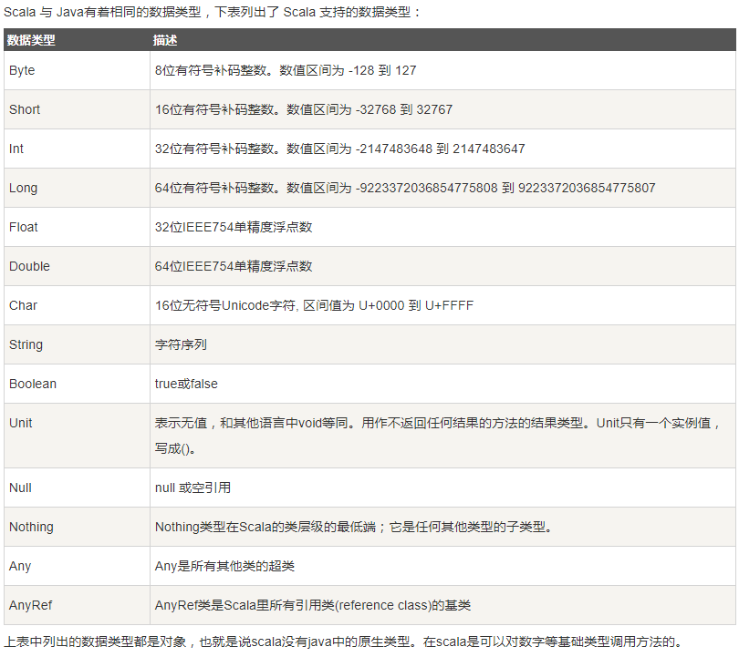
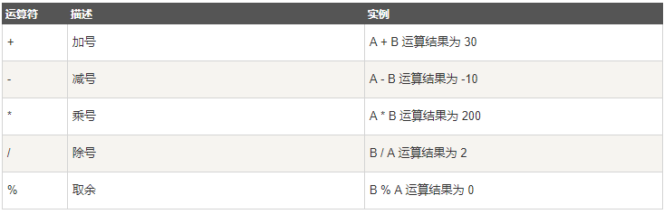
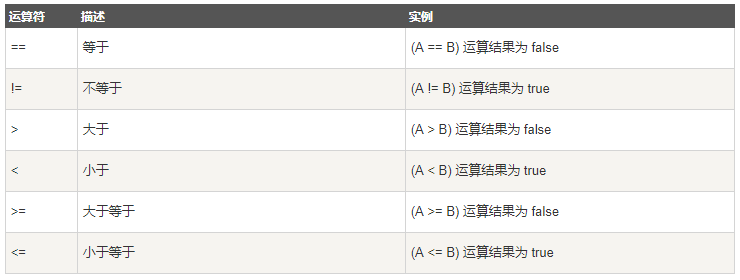
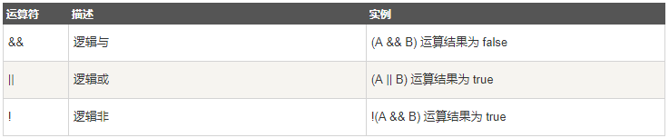
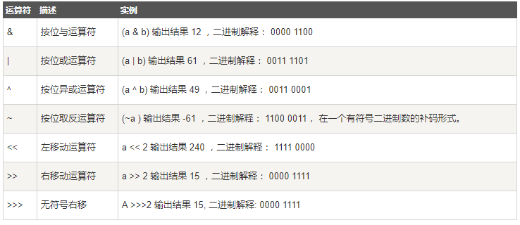
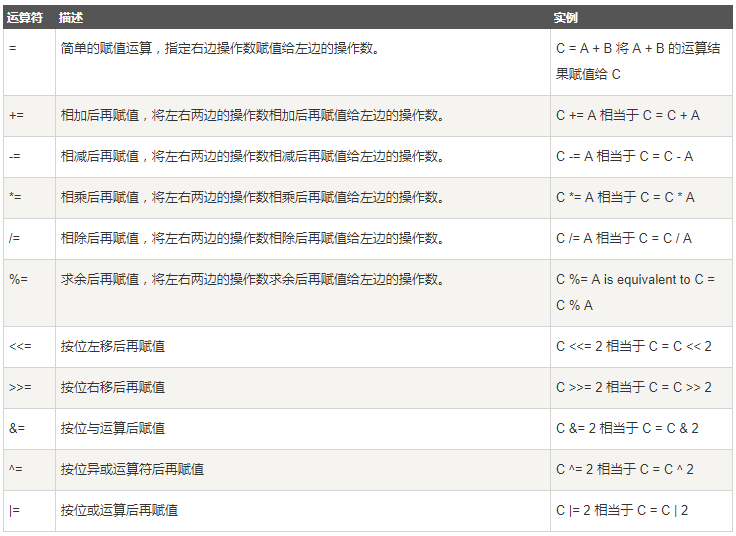
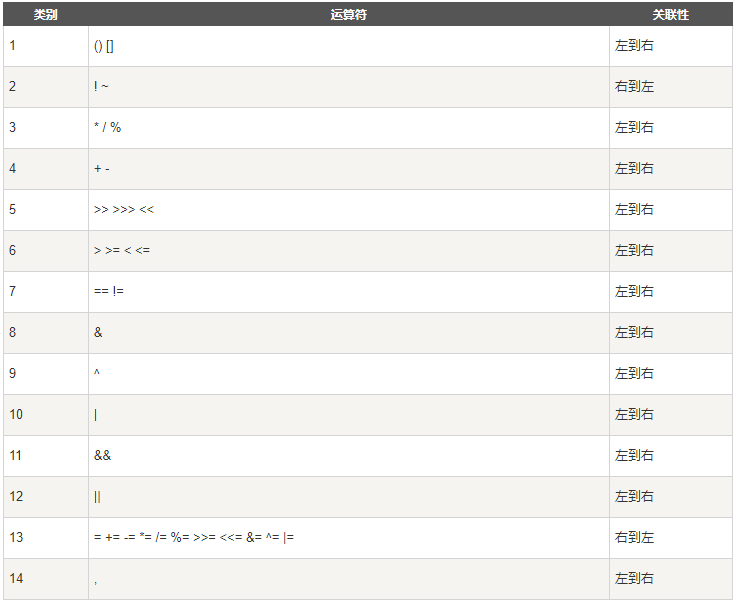

# Scala 入门
> 内容
  * [简介](#intro)
  * [Scala 安装](#install)
  * [Scala 变量](#variable)
  * [Scala 访问修饰符](#access)
  * [Scala 运算符](#operater)
  * [Scala IF...ELSE](#ifelse)
  * [Scala 循环](#for)
  * [Scala 函数](#function)

## <a name="intro"/>简介
Scala 是 Scalable Language 的简写，是一门多范式的编程语言
1. Scala 特性
  * 面向对象
  * 函数式编程
  * 静态类型
2. Scala Web框架
  * Lift框架
  * Play框架

## <a name="install"/>Scala 安装
1. 安装JDK
2. 到[Scala官网地址](http://www.scala-lang.org/downloads)下载Scala二进制包
3. 安装，添加环境变量（`SCALA_HOME`），并配置到Path下

## Scala基础语法
1. Scala命名规范
    1. 区分大小写：大小写敏感
    2. 类名：首字母大写
    3. 方法名：首字母小写，后面单词大写
    4. 程序文件名与对象名匹配
2. 标识符
Scala 可以使用两种形式的标志符，字符数字和符号。

字符数字使用字母或是下划线开头，后面可以接字母或是数字，符号"\$"在 Scala 中也看作为字母。然而以"$"开头的标识符为保留的 Scala 编译器产生的标志符使用，应用程序应该避免使用"$"开始的标识符，以免造成冲突。

Scala 的命名规则采用和 Java 类似的 camel 命名规则，首字符小写，比如 toString。类名的首字符还是使用大写。此外也应该避免使用以下划线结尾的标志符以避免冲突。符号标志符包含一个或多个符号，如\+，\:，? 等

Scala 内部实现时会使用转义的标志符，比如\:\-\> 使用 \$colon\$minus\$greater 来表示这个符号。因此如果你需要在 Java 代码中访问\:\-\>方法，你需要使用 Scala 的内部名称 \$colon\$minus\$greater。

混合标志符由字符数字标志符后面跟着一个或多个符号组成，比如 unary\_\+ 为 Scala 对\+方法的内部实现时的名称。字面量标志符为使用\`\`（反引号）定义的字符串，比如 \`x\` \`yield\`。

你可以在"之间使用任何有效的 Scala 标志符，Scala 将它们解释为一个 Scala 标志符，一个典型的使用为 Thread 的 yield 方法， 在 Scala 中你不能使用 Thread\.yield\(\)是因为 yield 为 Scala 中的关键字， 你必须使用 Thread.\`yield\`\(\)来使用这个方法。

3. Scala关键字

| | | | |
|:---:|:---:|:---:|:---:|
|abstract|case|catch|class|
|def|do|else|extends|
|false|final|finally|for|
|forSome|if|implicit|import|
|lazy|match|new|null|
|object|override|package|private|
|protected|return|sealed|super|
|this|throw|trait|try|
|true|type|val|var|
|while|	with|yield|
|\-|\:|\=|\=\>|
|\<\-|<\:|\<\%|\>\:|
|\#|\@|||

4. Scala注释
同Java

5. 换行符
Scala是面向行的语言，语句可以用分号（\;）结束或换行符。Scala 程序里,语句末尾的分号通常是可选的。如果你愿意可以输入一个,但若一行里仅 有一个语句也可不写。另一方面,如果一行里写多个语句那么分号是需要的。

6. 定义包
Scala 使用 package 关键字定义包，在Scala将代码定义到某个包中有两种方式：

第一种方法和 Java 一样，在文件的头定义包名，这种方法就后续所有代码都放在该包中。
```
package cn.xuemengzihe
class HelloWorld
```
第二种方法有些类似 C\#，如：
```
package cn.xuemengzihe {
  class HelloWorld 
}
```

7. 引用
Scala 使用 import 关键字引用包。
```
import java.awt.Color  // 引入Color
 
import java.awt._  // 引入包内所有成员
 
def handler(evt: event.ActionEvent) { // java.awt.event.ActionEvent
  ...  // 因为引入了java.awt，所以可以省去前面的部分
}
```
import语句可以出现在任何地方，而不是只能在文件顶部。import的效果从开始延伸到语句块的结束。这可以大幅减少名称冲突的可能性。

如果想要引入包中的几个成员，可以使用selector（选取器）：
```
import java.awt.{Color, Font}
 
// 重命名成员
import java.util.{HashMap => JavaHashMap}
 
// 隐藏成员
import java.util.{HashMap => _, _} // 引入了util包的所有成员，但是HashMap被隐藏了
```
> **注意**：默认情况下，Scala 总会引入`java.lang._`、`scala._`和`Predef._`，这里也能解释，为什么以scala开头的包，在使用时都是省去`scala.`的。

8. Scala 数据类型



* 整型字面量

整型字面量用于 Int 类型，如果表示 Long，可以在数字后面添加 L 或者小写 l 作为后缀。

* 浮点型字面量
如果浮点数后面有f或者F后缀时，表示这是一个Float类型，否则就是一个Double类型的。

* 布尔型字面量

布尔型字面量有 true 和 false。

* 符号字面量

符号字面量被写成： '\<标识符\> ，这里\<标识符\>可以是任何字母或数字的标识（注意：不能以数字开头）。这种字面量被映射成预定义类`scala.Symbol`的实例。

如： 符号字面量 `'x`是表达式`scala.Symbol("x")`的简写，符号字面量定义如下：
```
package scala
final case class Symbol private (name: String) {
   override def toString: String = "'" + name
}
```
* 字符字面量

在scala中字符类型表示为半角单引号\(\'\)中的字符

* 字符串字面量

字符串表示方法是在双引号中\(\"\) 包含一系列字符

* 多行字符串的表示方法

多行字符串用三个双引号来表示分隔符，格式为：\"\"\" \.\.\. \"\"\"。

* Null 值

空值是`scala.Null`类型。

`Scala.Null`和`scala.Nothing`是用统一的方式处理Scala面向对象类型系统的某些\"边界情况\"的特殊类型。

Null类是null引用对象的类型，它是每个引用类（继承自AnyRef的类）的子类。Null不兼容值类型。

## <a name="variable" />Scala 变量
* 变量与常量。
  * 一、变量：在程序运行过程中其值可能发生改变的量叫做变量。
  * 二、常量：在程序运行过程中其值不会发生变化的量叫做常量。

在 Scala 中，使用关键词`var`声明变量，使用关键词`val`声明常量。

* 变量类型声明

变量的类型在变量名之后等号之前声明。定义变量的类型的语法格式如下：
```
var VariableName : DataType [=  Initial Value]
或
val VariableName : DataType [=  Initial Value]
```

变量声明不一定需要初始值，以下也是正确的：
```
var myVar :Int;
val myVal :String;
```

* 变量类型引用
在 Scala 中声明变量和常量不一定要指明数据类型，在没有指明数据类型的情况下，其数据类型是通过变量或常量的初始值推断出来的。
所以，如果在没有指明数据类型的情况下声明变量或常量必须要给出其初始值，否则将会报错。

## <a name="access" />Scala 访问修饰符
Scala 访问修饰符基本和Java的一样，分别有：private，protected，public。

如果没有指定访问修饰符符，默认情况下，Scala对象的访问级别都是 public。

Scala 中的 private 限定符，比 Java 更严格，在嵌套类情况下，外层类甚至不能访问被嵌套类的私有成员。

* 私有\(Private\)成员
用private关键字修饰，带有此标记的成员仅在包含了成员定义的类或对象内部可见，同样的规则还适用内部类。
```
class Outer{
    class Inner{
    private def f(){println("f")}
    class InnerMost{
        f() // 正确
        }
    }
    (new Inner).f() //错误
}
```
`(new Inner).f( )`访问不合法是因为 f 在 Inner 中被声明为 private，而访问不在类Inner之内。

但在 InnerMost 里访问f就没有问题的，因为这个访问包含在 Inner 类之内。

Java中允许这两种访问，因为它允许外部类访问内部类的私有成员。

* 保护\(Protected\)成员
在 scala 中，对保护（Protected）成员的访问比 java 更严格一些。
因为它只允许保护成员在定义了该成员的的类的子类中被访问。
而在java中，用protected关键字修饰的成员，除了定义了该成员的类的子类可以访问，同一个包里的其他类也可以进行访问。
```
package p{
class Super{
    protected def f() {println("f")}
    }
	class Sub extends Super{
	    f()
	}
	class Other{
		(new Super).f() //错误
	}
}
```
上例中，Sub 类对 f 的访问没有问题，因为 f 在 Super 中被声明为 protected，而 Sub 是 Super 的子类。
相反，Other 对 f 的访问不被允许，因为 other 没有继承自 Super。而后者在 java 里同样被认可，因为 Other 与 Sub 在同一包里。

* 公共\(Public\)成员
Scala中，如果没有指定任何的修饰符，则默认为 public。这样的成员在任何地方都可以被访问。
```
class Outer {
   class Inner {
      def f() { println("f") }
      class InnerMost {
         f() // 正确
      }
   }
   (new Inner).f() // 正确因为 f() 是 public
}
```
* 作用域保护
Scala中，访问修饰符可以通过使用限定词强调。格式为：
```
private[x] 
或 
protected[x]
```
这里的x指代某个所属的包、类或单例对象。如果写成`private[x]`,读作这个成员除了对`[…]`中的类或`[…]`中的包中的类及它们的伴生对像可见外，对其它所有类都是`private`。

这种技巧在横跨了若干包的大型项目中非常有用，它允许你定义一些在你项目的若干子包中可见但对于项目外部的客户却始终不可见的东西。
```
package bobsrocckets{
    package navigation{
        private[bobsrockets] class Navigator{
         protected[navigation] def useStarChart(){}
         class LegOfJourney{
             private[Navigator] val distance = 100
             }
            private[this] var speed = 200
            }
        }
        package launch{
        import navigation._
        object Vehicle{
        private[launch] val guide = new Navigator
        }
    }
}
```
上述例子中，类Navigator被标记为`private[bobsrockets]`就是说这个类对包含在bobsrockets包里的所有的类和对象可见。

比如说，从Vehicle对象里对Navigator的访问是被允许的，因为对象Vehicle包含在包launch中，而launch包在bobsrockets中，相反，所有在包bobsrockets之外的代码都不能访问类Navigator。

## <a name="operater" />Scala 运算符
Scala中内置的运算符
* 算术运算符



* 关系运算符



* 逻辑运算符



* 位运算符



* 赋值运算符



**优先级**：



## <a name="ifelse" /> IF\.\.\.ELSE
与Java神似
* `if...else`
* `if...else if...else`

## <a name="for" /> Scala 循环
* while循环
```
while(condition)
{
   statement(s);
}
```
* do while循环
```
do {
   statement(s);
} while( condition );
```
* for循环
```
for( var x <- Range ){
   statement(s);
}
# 以上语法中，Range 可以是一个数字区间表示 i to j ，或者 i until j。左箭头 <- 用于为变量 x 赋值。
```

以下是一个使用了 i to j 语法\(包含 j\)的实例：
```
object Test {
   def main(args: Array[String]) {
      var a = 0;
      // for 循环
      for( a <- 1 to 10){
         println( "Value of a: " + a );
      }
   }
}
```
在for循环中你可以使用分号 \(\;\) 来设置多个区间，它将迭代给定区间所有的可能值。以下实例演示了两个区间的循环实例：
```
object Test {
   def main(args: Array[String]) {
      var a = 0;
      var b = 0;
      // for 循环
      for( a <- 1 to 3; b <- 1 to 3){
         println( "Value of a: " + a );
         println( "Value of b: " + b );
      }
   }
}
```

for 循环集合的语法如下：
```
for( var x <- List ){
   statement(s);
}
```

for 循环过滤
```
for( var x <- List
      if condition1; if condition2...
   ){
   statement(s);
 }
```

for 使用 yield
```
var retVal = for{ var x <- List
     if condition1; if condition2...
}yield x
```
**注意**大括号中用于保存变量和条件，retVal 是变量， 循环中的 yield 会把当前的元素记下来，保存在集合中，循环结束后将返回该集合。

个人Demo
```
object MyScala {
  def main(args: Array[String]): Unit = {
    for (i <- 1 to 100) {
      println("Hello Scala" + i)
    }
    for (i <- 1 to 10; j <- 1 to 10) {
      println(i + ":" + j);
    }
    for (i <- 1 to 10; j <- 1 to 10 if i % 2 == 0; if j % 2 == 0) {
      println(i + ":" + j);
    }
    var sets = for {
      i <- 1 to 10; j <- 1 to 10 if i % 2 == 0; if j % 2 == 0
    } yield i
    for (i <- sets) {
      println("Set member:" + i)
    }
  }
}
```

## <a name="function" /> Scala 函数
Scala 有函数和方法，二者在语义上的区别很小。Scala 方法是类的一部分，而函数是一个对象可以赋值给一个变量。换句话来说在类中定义的函数即是方法。

我们可以在任何地方定义函数，甚至可以在函数内定义函数（内嵌函数）。更重要的一点是 Scala 函数名可以有以下特殊字符：`+, ++, ~, &,-, -- , \, /, :`等。

## 函数声明
* Scala 函数声明

格式如下：
```
def functionName ([参数列表]) : [return type]
```
如果你不写等于号和方法主体，那么方法会被隐式声明为“抽象\(abstract\)”，包含它的类型于是也是一个抽象类型。

* 函数定义

方法定义由一个def 关键字开始，紧接着是可选的参数列表，一个冒号“：”和方法的返回类型，一个等于号“\=”，最后是方法的主体。

Scala 函数定义格式如下：
```
def functionName ([参数列表]) : [return type] = {
   function body
   return [expr]
}
```
以上代码中 return type 可以是任意合法的 Scala 数据类型。参数列表中的参数可以使用逗号分隔。

如果函数没有返回值，可以返回为 Unit，这个类似于 Java 的 void。


