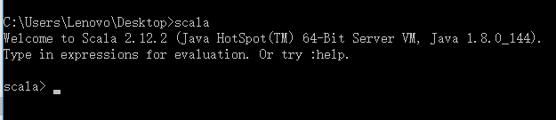
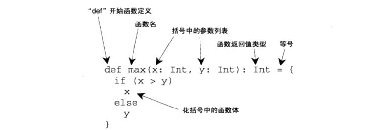
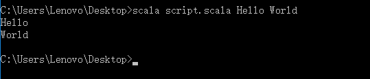

# 第2章 Scala入门初探
> 

## 2.1 第一步 学习使用Scala解释器
开始学习Scala最简单的方法就是使用Scala解释器，它是编写Scala表达式和程序的交互式和程序“Shell”。只要在解释器里输入表达式，它就能计算并打印结果值。Scala的交互式Shell就叫做scala。可以在命令提示符里输入scala，执行效果如下：



**注意**：退出Shell，`:quit`或`:q`，还可以使用`Ctrl + D`组合键。

## 2.2 第二步 变量定义
* Scala有两种变量，val（常量）和var（变量）。
* Scala借助于类型推演（type inference）可以在定义变量时不声明类型。


## 2.3 第三步 函数定义


**注意**：在Java里，从方法里返回的值类型被称为返回类型。在Scala里，同样的概念被叫做结果类型。

## 2.4 编写Scala脚本
Scala脚本的命令行参数保存在名为args的Scala数组中。

## 2.5 第五步 用while做循环；用if做判断
打印Scala脚本的命令行参数

脚本内容：
```
var i = 0 
while(i < args.length) {
    println(args(i))
    i += 1
}
```

执行语句：
```
形式：scala [脚本名称] [参数1] [参数2] [参数3] ...
scala script.scala Hello World
```

执行结果：



## 2.6 第六步 用foreach和for做枚举
上面的while循环的编码风格被称为是指令式（imperative）编程。而下面的循环倾向于函数式编程
```
args.foreach(arg => println(arg))
// 正规形式： args.foreach((arg: String) => println(arg))
// 精简形式： args.foreach(println)
// for 形式：for ( arg <- args)
                println(arg)
```