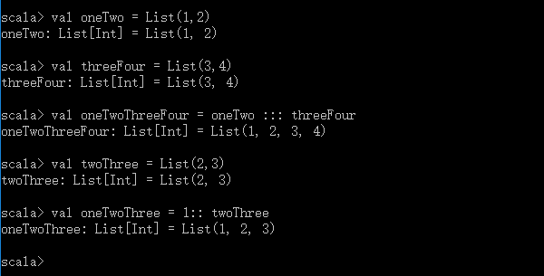
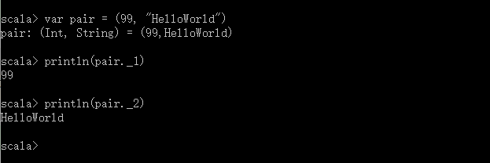
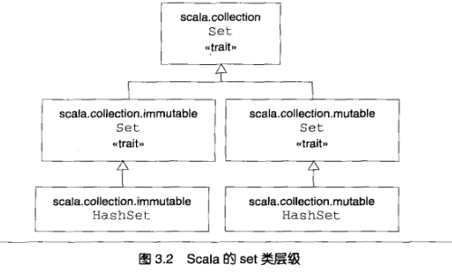
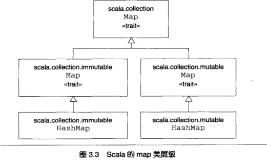
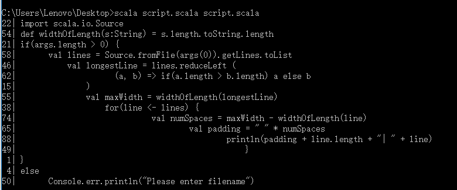

# 第3章 Scala入门再探
>

## 3.1 第七步 使用类型参数化数组（Array）
```
val array = new Array[String](3)
// var array : Array[String] = new Array[String](3)
```
从技术层面来说，Scala没有操作符重载，因为它没有传统意义上的操作符。取而代之的是，诸如\+，\-，\*和这样的字符，可以用来做方法名。因此，当我们在第一步中往Scala解释器里输入1 \+ 2的时候，实际是在Int对象1上调用\+的方法，并把2当作参数传给它，如图3\.1所示。当然1\+2更为传统的语法格式可以写成\(1\)\.\+\(2\)。

Scala数组是可变的同类对象序列，但长度固定。

## 3.2 第八步 使用列表（List）
```
val oneTwo = List(1,2)
val threeFour = List(3,4)
val oneTwoThreeFour = oneTwo ::: threeFour
val twoThree = List(2,3)
val oneTwoThree = 1:: twoThree
```
执行结果：



**注意**：表达式“1::twoThree”中，`::`是右操作数twoThree的方法。你或许会质疑是否`::`方法的关联性有错误，不过请记住这只是个简单的规则：如果方法使用操作符来标注，如a \* b，那么左操作数是方法的调用者，可以改写成`a.*(b)`——除非——方法名以冒号结尾。这种情况下，方法被右操作数调用。因此，`1 :: twoThree`里，`::`方法的调用者是twoThree，1是方法的传入参数，因此可以改写成：`twoThree.::(1)`。

* Scala的列表一旦创建就不可改变。
* `Nil`是空列表的简写。

* 为什么列表不支持添加（append）操作？

List类没有提供append操作，因为随着列表变长，append的耗时将呈线性增长，而使用`::`做前缀则仅耗用固定的时间。如果你想通过添加元素来构造列表，你的选择是先把它们前缀进去，完成之后再调用reverse；或使用ListBuffer，一种提供append操作的可变列表，完成之后调用toList。

表3.1 List的一些方法和作用

|方法名|方法作用|
|:-----|:------|
|`List()`或Nil|空List|
|`List("Coll", "tools", "rule")`|创建带有三个值的新List\[String\]|
|`val thrill = "Will"::"fill"::"until"::Nil`|创建带有三个值的新List\[String\]|
|`List("a","b"):::List("c", "d")`|叠加两个列表|
|`thrill(2)`|返回在thrill列表上索引为2（基于0）的元素（“until”）|
|`thrill.count(s => s.length == 4)`|计算长度为4的String元素个数（2）|
|`thrill.drop(2)`|返回去掉前两个元素的thrill列表（List（“until”））|
|`thrill.dropRight(2)`|返回去掉前两个元素的thrill列表（List（“Will”））|
|`thrill.exists(s => s == "until")`|判断是否有值为“until”的字符串元素在thrill里（true）|
|`thrill.filter(s => s.length == 4)`|返回长度为4的元素依次组成的新列表（List（“Will”，“fill”））|
|`thrill.forall(s => s.endsWith("l"))`|判断是否thrill列表里所有元素都以“1”结尾（true）|
|`thrill.foreach(s => print(s))`|对thrill列表每个字符串执行print语句（“Willfilluntil”）|
|`thrill.foreach(print)`|与前相同，不过更简洁（同上）|
|`thrill.head`|返回thrill列表的第一个元素（“Will”）|
|`thrill.init`|返回thrill列表除最后一个以外其它元素组成的列表（List（“Will”，“fill”））|
|`thrill.isEmpty`|返回thrill列表是否为空（false）|
|`thrill.last`|返回thrill列表的最后一个元素（“until”）|
|`thrill.length`|返回由thrill列表的元素数量（3）|
|`thrill.map(s => s + "y")`|返回由thrill列表里每一个String元素都加了“y”构成的列表（List（“Willy”，“filly”，“untily”））|
|`thrill.mkString(", ")`|返回用列表的元素组成的字符串（“Will， fill， until”）|
|`thrill.remove(s => s.length == 4)`|返回去除了thrill列表中长度为4的元素后的元素依次组成的新列表（List（“until”））|
|`thrill.reverse`|返回由thrill列表的元素逆序组成的新列表（List（“until”，“fill”，“Will”））|
|`thrill.sort((s, t) => s.charAt(0).toLowerCase < t.charAt(0).toLowerCase)`|返回thrill列表元素按照第一个字符的字母小写排序之后依次组成的新列表（List（“fill”，“until”，“Will”））|
|`thrill.tail`|返回thrill列表中除第一个元素之外依次组成的新列表（List（“fill”，“until”））|

## 3.3 第九步 使用元组（Tuple）
元组与列表一样，元组是不可变的；但与列表不同，元组可以包含不同类型的元素。



**注意**：你或许想知道为什么用访问列表的方法来访问元组，如pair（0）。那是因为列表的apply方法始终返回同样的类型，但元组里的类型不尽相同。\_1的结果类型可能与\_2的不一致，诸如此类，因此两者的访问方法也不一样。另外，这些\_N的索引是基于1的，而不是基于0的，这是因为对于拥有静态类型元组的其他语言，如Haskell和ML，从1开始是传统的设定。

## 3.4 第十步 使用集（set）和映射（map）
Scala致力于充分利用函数式编程和指令式编程两方面的好处，因此它的集合库区分为可变类型和不可变类型。例如，array具有可变性，而list保持不变。对于set和map来说，Scala同样有可变和不可变的，不过并非分别提供两种类型，而是通过类继承的差别把可变性差异蕴含其中。
例如，Scala的API包含了set的基本特质（trait），特质这个概念接近于Java的接口。Scala还提供了两个子特质，分别为可变set和不可变set。如图3.2所示，这三个特质都共享同样的简化名，set。然而它们的全称不一样，每个特质都在不同的包里。Scala的API里具体的set类，如图3.2的HashSet类，各有一个扩展了可变的和另一个扩展不可变的Set特质。（Java里面称为“实现”了接口，而在Scala里面称为“扩展”或“混入”了特质。）因此，使用HashSet的时候，可以根据需要选择可变的或不可变的类型。



另一种Scala里常用的集合类是Map，和Set一样，Scala采用了类继承机制提供了可变的和不可变的两种版本的Map，参见图3.3。map的类继承机制看上去和set的很像。Scala\.collection包里面有一个基础Map特质和两个子特质Map：可变的Map在`scala.collection.mutable`里，不可变的Map在`scala.collection.immutable`里。



## 3.5 第十一步 学习识别函数式风格
我们首要工作是这两种风格在代码上的差异。大致可以说：
* 代码中**包含了**var变量 \-\-\> *可能*是指令式风格
* 代码中**仅仅包含**val变量 \-\-\> *可能*是函数式风格

while循环（指令式风格）：
```
def printArgs(args : Array[String]) : Unit = {
    var i = 0;
    while( i < args.length) {
        println(args(i))
        i += 1
    }
|
```
while循环（函数式风格）：
```
def printArgs(args : Array[String]) : Unit = {
    for(arg <- args)
        print(arg)
}
或
def printArgs(args : Array[String]) : Unit = {
    args.foreach(println)
}
```
这个例子说明了减少使用var的一个好处。重构后（更函数式）的代码比原来（更指令式）的代码更简洁、明白，也更少有机会犯错。Scala鼓励函数式风格的原因，实际上也就是函数式风格可以帮助你写出更容易读懂，同样也不易犯错的代码。

当然，这段代码仍有改进的余地。重构后的printArgs方法并不是纯函数式的，因为它有副作用——本例中的副作用就是打印到标准输出流。识别函数是否有副作用的地方就在于其结果类型是否为Unit。如果某个不返回任何有用的值，也就是说如果返回类型为Unit，那么这个函数唯一能产生的作用就只能是通过某种副作用。而函数风格应该是定义对需要打印arg进行格式化的方法，仅返回格式化之后的字符串，如下：
```
def formatArgs(args : Array[String]) = args.mkString("\n")
```

Scala的assert方法检查传入的Boolean表达式，如果结果为假，抛出AssertionError；否则assert就什么也不做，安静的返回。

## 3.6 第十二步 从文件里读取文本行
```
import scala.io.Source
if(args.length > 0)
    for(line <- Source.fromFile(args(0)).getLines)
        print(line.length + " " + line)
else
    Console.err.println("Please enter filename")
```
Update版
```
import scala.io.Source
def widthOfLength(s:String) = s.length.toString.length
if(args.length > 0) {
    val lines = Source.fromFile(args(0)).getLines.toList
    val longestLine = lines.reduceLeft (
        (a, b) => if(a.length > b.length) a else b
    )
    val maxWidth = widthOfLength(longestLine)
    for(line <- lines) {
        val numSpaces = maxWidth - widthOfLength(line)
        val padding = " " * numSpaces
        println(padding + line.length + "| " + line)
    }
}
else
    Console.err.println("Please enter filename")
```
执行结果：



## 3.7 小结
