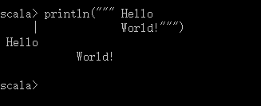
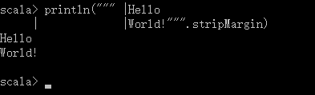
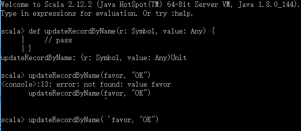
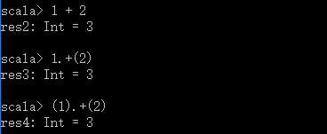
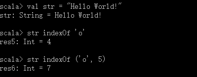
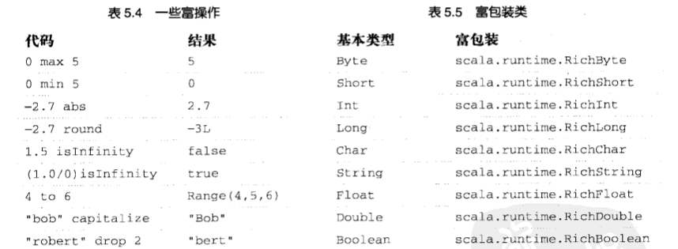

# 第5章 基本类型和操作
>

## 5.1 基本类型
* 整数类型：Byte、Short、Int、Long
* 数类型：整数类型、Float、Double

表5\.1 一些基本类型

|值类型|范围|
|:-----|:--|
|Byte|8位有符号补码整数|
|Short|16位有符号补码整数|
|Int|32位有符号补码整数|
|Long|64位有符号补码整数|
|Char|16位无符号Unicode字符|
|String|char序列|
|Float|32位IEEE754浮点数|
|Double|64位IEEE754浮点数|
|Boolean|true或false|

除了String归于java\.lang包之外，其余所有的基本类型都是包scala的成员。

**注意**：目前实际上Scala值类型可以使用与Java的原始类型一致的小写化名称，比如，Scala程序里可以用int替代Int。Scala社区推荐风格是一直使用大写形式。

## 5.2 字面量
所有在表5\.1中列出的基本类型都可以写成字面量（literal）。字面量就是直接写在代码里的常量值。

（同Java）

字符串字面量中引入了一种特殊的语法。它以同一行里的三个引号（\"\"\"）作为开始和结束。内部的原始字符串可以包含任意字符。
```
println(""" Hello 
            World!""")
```
运行结果：



某些情况下上面的输出并非我们期望的，为了解决这个情况，字符串引入了stripMargin方法。使用的方式是，把管道符号（\|）放在每行前面，然后对整个字符串调用stripMargin方法
```
println(""" |Hello 
            |World!""".stripMargin)
```
运行结果：



**符号字面量**

符号字面量被写成`'<标识符>`，这里\<标识符\>可以是任何字母或数字的标识符。这种字面量被映射成预定义类scala\.Symbol的实例。具体地说，就是字面量`'cymbal`将被编译器扩展为工厂方法调用：`Symbol("cymbal")`。符号字面量典型的应用场景是在动态类型语言中使用一个标识符。例如，定义更新数据库记录的方法：
```
def updateRecordByName(r: Symbol, value: Any) {
    // pass
}
updateRecordByName: (Symbol,Any) Unit
```
方法有两个参数，符号参数表示记录的字段名，Any类型的参数表示应该更新至记录的值。动态类型语言可以通过向方法传入未声明字段标识符调用这个操作，但在Scala里这样会编译不通过，代替方案同样简洁，你传递一个符号字面量即可，如图：



符号字面量除了是被限定（interned）的。如果同一个符号字面量出现两次，那么两个字面量指向的是同一个Symbol对象。

## 5.3 操作符和方法
Scala为基本类型提供了丰富的操作符集。如前几章描述的，这些操作符实际只是普通方法调用的另一种表现形式。例如，1 \= 2 与 \(1\)\.\+\(2\)其实是一回事。换句话说，就是Int类包含了叫做\+的方法，它传入一个Int参数并返回一个Int结果，在两个Int值相加时被调用。



符号\+是操作符——更明确地说，是中缀操作符。操作符标注不仅限于像\+ 这种其它语言里看上去像操作符的东西，任何方法都可以当作操作符来标注，另外，String还提供了重载的indexOf方法，带两个参数，分别是要搜索的字符和从哪个索引开始搜索，尽管这个indexOf方法带两个参数，你仍然可以用操作符标注的方式使用它，这时参数必须放在括号内。例如：



**注意**：Scala里操作符不是特殊的语法：任何方法可以是操作符。到底是方法还是操作符取决于你如何使用它。如果写成`s.indexOf('o')`，indexOf就不是操作符。但如果写成`s indexOf 'o'`，那么indexOf就是操作符，因为你以操作符标注方式使用它。

到目前为止，你已经看到了中缀操作符标注的例子，也就是说调用的方法位于和传递给方法的参数或若干参数之间，如“7 \+ 2”。Scala还有另外两种操作符标注方式，分别是前缀标注和后缀标注。前缀标注中，方法名被放在调用的对象之前，如，\-7 里的“\-”。后缀标注中，方法放在对象之后，如，“7 toLong”里的“toLong”。

与中缀操作符——两个操作符，分别在操作符的左右两侧——相反，前缀和后缀操作符都是一元（unary）的：它们仅有一个操作数。前缀方式中，操作数在操作符的右边。前缀操作符与中缀操作符一致，是值类型对象调用方法的简写形式。然而这种情况下，方法名在操作符上前缀“unary\_”。例如，Scala会把表达式`-2.0`转换成方法调用`(2.0).unary_-`。这可以通过分别输入操作符和显式方法名两种方式调用方法加以证实：


标识符中能作为前缀操作符用的只有\+、\-、\!和\~。因此，如果对类型定义了名为unary\_\!的方法，就可以对值或变量用\!p这样的前缀操作符方式调用方法。但是即使定义了名为unary\_\*的方法，也没有办法将其用成前缀操作符了，因为\*不是四种可以当作前缀操作符的标识符之一。你可以像平常那样调用它，如`p.unary_*`，但如果尝试像\*p这么调用，Scala就会把它理解为\*\.p，这或许就不是你所期望的了。

后缀操作是不用点或括号调用的不带任何参数的方法。在Scala里，方法调用的空括号可以省略。惯例是如果方法带有副作用就加上括号，如println\(\)；如果没有副作用就去掉括号，如String的toLowerCase方法：

## 5.4 数学运算

## 5.5 关系和逻辑操作

## 5.6 位操作符

## 5.7 对象相等性

## 5.8 操作符的优先级和关联性
表5.3 操作符优先级

|操作符|
|:----|
|\* \/ \%|
|\+ \-|
|\:|
|\= \!|
|\<\>|
|\&|
|\^|
|\||
|（所有字母）|
|（所有赋值操作符）|

操作符的优先级决定了表达式的哪个部分先于其他部分被评估。举例来说，表达式`2 + 2 * 7`计算得16，而不是28，因为\*操作符比\+操作符有更高的优先级。因此表达式的乘法部分先于加法部分被评估。当然你也可以在表达式里使用括号来理清评估或覆盖优先级。

由于Scala没有操作符，实际上，操作符只是方法的一种表达式，你或许想知道操作符优先级是怎么做到的。对于以操作符形式使用的方法，Scala根据操作符的第一个字符判断方法优先级（这个方法有个例外，稍后再说）。比方说，如果方法名开始于\* ，那么就比开始于\+的方法有更高的优先级。

表5\.3以降序方式列举了以方法第一个字符判定优先级，同一行字符具有同样的优先级。表中字符的位置越高，以这个字符开始的方法具有更高的优先级。

除了以上提到的优先级规则外这有以等号结束的赋值操作符。如果操作符以等号字符（\=）结束，且操作符并非比较操作符\<\=，\>\=，\=\=或\=，那么这个操作符的优先级与赋值符（\=）相同。也就是说，它比任何其他操作符的优先级都低。

当同样优先级的多个操作符并列出现在表达式里时，操作符的关联性决定了操作符分组的方式。Scala里操作符的关联取决于它的最后一个字符。正如第3章里提到的，任何以“\:”字符结尾的方法由它的右操作数调用，并传入左操作数。以其他字符结尾的方法与之相反。它们都是被左操作数调用，并传入右操作数的。因此a \* b变成`a.*(b)`，但是`a:::b`变成`b.:::(a)`。

然而，不论操作符具有什么样的关联性，它的操作数总是从左到右评估的。因此如果b是一个表达式而不仅仅是一个不可变值的引用，那么更精确的意义上说，`a:::b`将会被当作是：
```
{ val x = a; b.:::(x) }
```
这个代码块中，a仍然在b之前被评估，然后评估结果被当作操作数传给b的\:\:\:方法。

这种关联性规则在同时使用多个具有同优先级的操作符时也会起作用。如果方法结束于\:，它们就被自右向左分组；反过来，就是自左向右分组。例如，`a:::b:::c`会被当作`a:::(b:::c)`。而`a * b * c`被当作`(a * b) * c`。

## 5.9 富包装器
Scala基本类型的可调用的方法远多于前几段里面讲到的。表5\.4里罗列了几个例子。这些方法的使用要通过隐式转换（implicit conversion），一种在第21章才会提到的技术。现在所有要知道的就是本章介绍过的每个基本类型，都对应着一个“富包装器”提供许多额外的方法。因此，想要看到基本类型的所有可用方法，还应该查看一下每个基本类型的富包装器的API文档。这些类可参见表5\.5。



## 5.10 小结