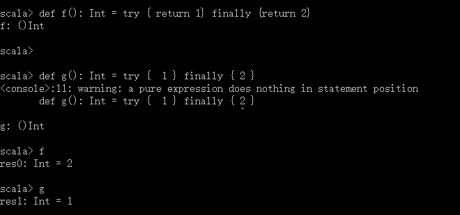

# 第7章 内建控制结构
> 

## 7.1 If表达式
```
println(if (!args.isEmpty) args(0) else "default.txt")
```

## 7.2 While循环
while和do\-while结构之所以被称为“循环”，而不是表达式，是因为它们不能产生有意义的结果。结果的类型的Unit，是表明存在并且唯一存在类型为Unit的值，称为unit value，写成\(\)。\(\) 的存在是Scala的Unit不同于Java的void的地方。

* 赋值语句返回的结果是\(\)

## 7.3 For表达式

* 枚举集合类
```
for (i <- 1 to 100)
    println ("Number: " + i)
```

* 过滤
```
// 过滤掉 10 
for (i <- 1 to 100 if i != 10)
    println ("Number: " + i)
// 如果加入多个过滤器，if子句之间用分号分隔
for (i <- 1 to 100 if i != 10; if i != 11)
    println ("Number: " + i)
```

* 嵌套枚举
```
for (i <- 1 to 9; j <- 1 to 9)
    println ("Number: " + i + " * " + j + " = " + i * j )
    
for {i <- 1 to 9
    j <- 1 to 9}
    println ("Number: " + i + " * " + j + " = " + i * j )
```
如果愿意的话，你可以使用花括号代替小括号包裹发生器和过滤器。使用花括号的好处是可以省略使用小括号时必须加的分号。

* 流间变量绑定
```
for (i <- 1 to 9;
    index = i;
    j <- 1 to 9 
    if index == j
    )
    println ("Number: " + i + " * " + j + " = " + i * j )
```
可以通过用等号（\=）把结果绑定到新变量实现，绑定的变量被当作val引入和使用，不过不带关键字val。如上面代码中的index。

* 制造新集合
```
for (i <- 1 to 100)
    yield i
// 或
for {i <- 1 to 100}
    yield i
```
for\-yield表达式的语法是这样的：
```
for { 子句 } yield { 循环体 }
```

## 7.4 使用try表达式处理异常
* 抛出异常
```
throw new IllegalArgumentException
```

* 捕获异常
```
import java.io.FileReader
import java.io.FileNotFoundException
import java.io.IOException

try {
    val f = new FileReader("input.txt")
    // 使用并关闭文件
} catch {
    case ex: FileNotFoundException => // 处理文件丢失
    case ex: IOException => // 处理IO错误
} finally {
    // Do Something
}
```
**注意**：Scala里不需要检查异常，或把它们声明在throws子句中。如果你愿意，你可以用\@throws注解声明throws子句，但这不是必须的。

* 生成值
和其它大多数Scala控制结构一样，try\-catch\-finally也产生值。返回的结果是，如果没有异常抛出，则对应于try子句；如果抛出异常并捕获，则对应于catch子句。如果异常被抛出但没有被捕获，表达式就没有返回值。由finally子句计算得到的值，即使有也会被抛弃。
```
def f(): Int = try { return 1} finally {return 2}

def g(): Int = try {  1 } finally { 2 }
```
执行结果：



## 7.5 匹配（match）表达式
Scala中的match表达式类似于其他语言中的switch语句。
```
val value = 2
value match {
    case 1 => println( "Case 1: " + value )
    case 2 => println( "Case 2: " + value )
    case 3 => println( "Case 3: " + value )
    case 4 => println( "Case 4: " + value )
    case 5 => println( "Case 5: " + value )
    case 6 => println( "Case 6: " + value )
    case _ => println( "Others: " + value )
}
```
* 任何类型都可以进行匹配；
* 每个case语句中隐含break语句；
* match也可以产生值

## 7.6 不再使用break和continue

## 7.7 变量范围

## 7.8 重构指令式风格的代码

## 7.9 小结