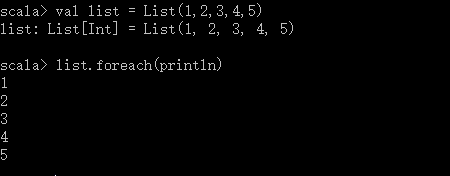

# 第8章 函数和闭包
> 对象函数、函数中的函数、函数字面量和函数值

## 8.1 方法
对象的成员

## 8.2 本地方法
定义在函数中的函数

## 8.3 头等函数
Scala的函数是头等函数（first\-class function）。你不仅可以把它们写成匿名的字面量（literal），并把它们作为值（value）传递。

函数字面量被编译进类，并在运行期实例化为函数值。因此函数字面量和值的区别在于函数字面量存在于源代码，而函数值作为对象存在于运行期。

例：函数字面量
```
(x: Int) => x + 1
// => 指明这个函数把左边的东西（任何整数x）转变成右边的东西（x+1）。所以，这个函数可以把任意x映射为x+1
```

函数值是对象，所以如果你愿意，可以将其存入变量，它们也是函数，所以你可以使用通常的括号函数调用写法调用它们。

**注意**：任何函数都是某个扩展了scala包的若干FunctionN特质之一的类的实例，如Function（）是没有参数的函数，Function1是有一个参数的函数等等。每个FunctionN都有一个apply方法来调用函数。

## 8.4 函数字面量的短格式
* 如果参数类型可以推断出来，则可以去除参数类型声明；
* 省略括号

## 8.5 占位符语法
如果想让函数字面量更简洁，只要每个参数在函数字面量内仅出现一次，就可以把下划线当做一个或更多参数的占位符。有时把下划线当作参数的占位符，编译器可能无法推断缺失的参数类型。这种情况下，你可以使用冒号指定类型，如：
```
val f = _ + _ // 错误，无法推断类型

val f = (_: Int) + (_: Int)

```
**注意**： 将\_ \+ \_ 扩展成带两个参数的函数字面量。这样也就解释了为何每个参数在函数字面量中最多出现一次时，你才能使用这种短格式。多个下划线指代多个参数，而不是单个参数的重复使用。第一个下划线代表第一个，第二个下划线代表第二个、第三个······，如此类推。

## 8.6 部分应用函数
在上面的例子里下划线替代的只是单个参数，你还可以使用单个下划线替换整个参数列表。例如，写成`println(_)`，或者更好的方法写成`println _`。此时，下划线不是单个参数的占位符。它是整个参数列表的占位符。请记住要在函数名和下划线之间留一个空格，因为不这样做编译器会认为你是在说明一个不同的符号，比方说是，似乎不存在名为`println_`的方法。以这种方式使用下划线时，你就正在写一个部分应用函数（partially applied function）。Scala里，当你调用任何需要的参数，实际是在把函数应用到参数上。部分应用函数是一种表达式，不需要提供函数的所有参数，代之以仅提供部分，或不提供所需参数。

这种一个下划线代表全部参数列表的表达式的另一种用途，就是把它当作转换def为函数值的方式。例如，如果你有一个本地函数，如`sum(a: Int, b: Int, c: Int): Int`，你可以把它“包装”成与apply方法具有同样的参数列表和结果类型的函数值。当你把这个函数值应用到某些参数上时，传递给其他方法，但是如果你通过在名称后面加下划线的方式把方法或嵌套函数包装在函数值中，就可以做到了。

如果你正在写一个省略所有参数的偏程序表达式，而且在代码的那个地方正需要一个函数，你可以去掉下划线从而表达得更简明。如：
```
val list = List(1,2,3,4,5)
list.foreach(println)
```


**注意**：这种格式仅在需要写函数的地方，如上面的foreach调用。编译器知道这种情况下需要一个函数，因为foreach需要一个函数作为参数传入。在不需要函数的情况下，尝试使用这种格式将引发一个编译错误。

## 8.7 闭包


## 8.8 重复参数
Java中的可变参数
```
def echo(args: String*) = 
    for(arg <- args)
        println(arg)

echo("hello", "World", "!")
```

函数内部，重复参数的类型是声明参数类型的数组。因此，echo函数里被声明为类型`String*`的args的类型实际上是`Array[String]`。然而，如果你有一个合适类型的数组，并希望把它当作重复参数，可以在数组后添加一个冒号和一个`_*`符号，如：
```
val strs = List("hello", "World", "!")
echo(strs:_*)
```

## 8.9 尾递归

## 8.10 小结
