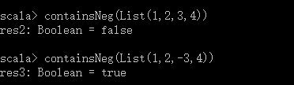
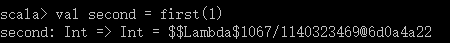
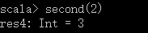
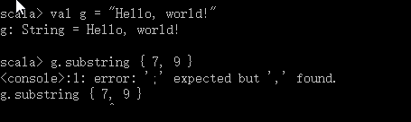

# 第9章 控制抽象
> 在第7章里，我们指出Scala没有太多的内建控制抽象，因为它为你提供了创建自己的控制抽象的能力。前一章里，你已经学习了函数值。本章将展示给你如何把函数值应用到创建新的控制抽象。同时，你还将学习柯里化和传名参数。

## 9.1 减少代码重复
所有的函数都可以被分成通用部分（它们在每次函数调用中都相同），以及非通用部分（在不同的函数调用中可能在会变化）。通用部分是函数体，而非通用部分必须由参数提供。当你把函数值用做参数时，算法的非通用部分就是它代表的某些其他算法。在这种函数调用传入的函数值。这种高阶函数——带其他函数做参数的函数——给了你额外的机会去组织和简化代码。

高阶函数的好处之一是它们能让你创造控制抽象从而减少代码重复。例如，假设你正在编写文件浏览器，并且想要提供API，以便使用者搜索匹配某些标准的文件。首先，你加入了搜索文件名结束特定字符串的机制。这能让你的用户发现，比方说，所有扩展名为`*.scala`的文件。你可以通过在单例对象中定义公开的filesEnding方法提供这样的API，如：
```
object FileMatcher {
    private def filesHere = ( new java.io.File(".")).listFiles
    
    def filesEnding(query: String) = 
        for (file <- filesHere;  if file.getName.endsWith(query))
            yield file
}
```
filesEnding方法通过使用私有帮助方法fileHere接受当前目录所有文件的列表，然后基于每个文件名以用户特定的查询结尾来过滤它们。由于filesHere是私有的，filesEnding方法是定义在提供给用户的API，FileMathcer中唯一可以访问的方法。

目前为止还挺好，没有重复的代码。然而你决定让别人可以基于文件的任何部分做查询。这个功能可以良好地用于以下情况：你的用户记不住他们是以`phb-important.doc`，`stupid-phb-report.doc`，`may2003saledoc.phb`，或什么完全不同的名字来命名文件的，但他们认为“phb”出现在文件的什么地方。你回到工作并把这个函数加到你的API，FileMatcher中：
```
def filesContaining(query: String) = 
    for(file <- filesHere; if file.getName.contains(query))
        yield file
```
这段函数与filesEnding很像。它搜索filesHere，检查名称，并且如果名称匹配则返回文件。唯一的差别是这个函数使用了contains替代endsWith。

随着时间的推移，程序变得更加成功。最后，你屈服于几个强势用户的需求，他们想要基于正则表达式搜索。这些马虎的家伙拥有数千个文件的超大目录，他们希望能做到像发现所有在题目中什么地方包含“oopsla”的“pdf”文件这样的事。为了支持他们，你写了这个函数：
```
def filesContaining(query: String) =
    for( file <- filesHere; if file.getName.matches(query))
        qield file
```
有经验的程序员会注意到所有的这些重复并想知道是否能从中提炼出通用的帮助函数。然而，显而易见的方式不起作用。你希望能做的是这样的：
```
def filesMatching(query: String, method) = 
    for (file <- filesHere; if file.getName.method(query))
        yield file
```
这种方式在某些动态语言中能起作用，但Scala不允许在运行期这样粘合代码。那么该怎么做呢？

函数值提供了一个答案。虽然你不能把方法名当作值传递，但你可以通过传递为你调用方法的函数值达到同样的效果。在这个例子里，你可以给方法添加一个matcher参数，其唯一的目的就是针对查询检查文件名：
```
def filesMatching(query:String, mathcer: (String, String) => Boolean) = {
    for (file <- filesHere; if mathcer(file.getName, query))
        yield file
}
```
方法的这个版本中，if子句现在使用matcher针对查询检查文件名。更精确的说法是这个检查不依赖于matcher定义了什么。现在看一下matcher的类型。它是一个函数，因此类型中有个`=>`。这个函数带两个字符串参数——文件名和查询——并返回布尔值，因此这个函数的类型是`(String, String) => Boolean`。

有了这个新的fileMatcher帮助方法，你可以通过三个搜索方法调用它，并传入合适的函数来简化它们：
```
def filesEnding(query: String) = 
    filesMathcing(query, _endsWith(_))
def filesContaining(query: String) = 
    fileMathcing(query, _.contains(_))
def filesRegex(query: String) = 
    filesMathcing(query, _.mathces(_))
```
这个例子中展示的函数字面量使用了前一章中介绍的点位符语法，对你来说可能感觉不是非常自然。因此，以下阐明例子里是如何使用占位符的。用在filesEnding方法里的函数字面量`_.endsWith(_)`，与下面的是一回事：
```
(fileName: String, query: String) => fileName.endsWith(query)
```
原因是filesMatching带一个函数，这个函数需要两个String参数，不过无须指定参数类型。因此，你也可以写成`(fileName.query) => fileName.endsWith(query)`。由于第一个参数fileName在方法体中被第一个使用，第二个参数query被第二个使用，你也可以使用占位符语法：`_.endsWith(_)`。第一个下划线是第一个参数文件名，第二个下划线是第二个参数查询字符串的占位符。

代码已经被简化了，但它实际这能更短。注意到query传递给了filesMatching，但filesMatching没有用查询做任何事，只是把它传回给传入的matcher函数。这个传来传去的过程不是必需的，因为调用者在前面就已经知道了query的内容。你可以同样从filesMatching和matcher中简单地去除query参数，因此简化后的代码如下：
```
object FileMatcher {
    private def filesHere = (new java.io.File(".")).listFiles
    
    private def filesMatching(matcher: String => Boolean) = 
        for(file <- filesHere; if matcher(file.getName))
            yield file
    
    def filesEnding(query: String) = 
        filesMatching(_.endsWith(query))
    def filesContaining(query: String) = 
        filesMatching(_.contains(query))
    def filesRegex(query: String) = 
        filesMatching(_.matches(query))
```
这个例子演示了函数作为头等值帮助你减少代码重复的方式，如果没有它们，这将变得很困难。比方说在Java里，你可以创建包括带一个String并返回Boolean的方法的接口，然后创建并传递实现这个接口的匿名内部类实例给filesMatching。尽管这个方式能去除你尝试简化掉的代码重复，但同时它增加了许多乃至更多的新代码。因此好处就不值这个开销了，于是你或许也就安于重复代码的现状了。

再者，这个例子还演示了闭包是如何能帮助你减少代码重复的。前面一个例子里用到的函数字面量，如`_endsWith(_)`和`_contains(_)`，都是在运行期实例化成函数值而不是闭包，因为它们没有捕获任何自由变量。举例来说，表达式`_.endsWith(_)`里用的两个变量，都是用下划线代表的，也就是说它们都是从传递给函数的参数获得的。因此，`_endsWith(_)`使用了两个绑定变量，而不是自由变量。相对地，最近的例子里面用到的函数字面量`_endsWith(query)`包含一个绑定变量，下划线代表的参数，和一个名为query的自由变量。仅仅因为Scala支持闭包才使得你可以在最近的这个例子里从filesMatching中去掉query参数，从而更进一步简化了代码。

## 9.2 简化客户代码
前一个例子演示了高阶函数能在你实现API的同时，帮助减少代码重复。高阶函数的另一个重要应用是把它们放在API里使客户端代码更简洁。Scala的集合类型的特定用途循环方法提供了一个很好的例子。很多已经在第3章的表3\.1中列了出来。不过现在请注意其中的一个例子来看看为什么这些方法如此有用。

考虑exists，一个判断传入的值是否包含集合中的方法。当然你可以初始化一个var为假，循环遍历集合类型，检查每个元素，并且如果你找到了要寻找的就把var为设置为真，通过这样的方式寻找元素。以下是使用了这种方式的方法去判断是否传入的List包含了负数的例子：
```
def containsNeg(nums: List[Int]): Boolean = {
    var exists = false
    for (num <- nums)
        if (num < 0)
        exists = true
    exists
}
```
假如你在解释器里定义了这个方法，就可以这样调用：  


不过更简洁的定义方式是对传入的List调用高阶函数exists，如：
```
def contains(nums: List[Int]) = nums.exists(_ < 0)
```
这个版本的containsNeg能产生和前面的那个一样的结果。

exists方法代表了控制抽象。是Scala库提供的特定用途循环架构而不是像while或for那样内建在Scala语言里的。上节中，高阶函数filesMatching在对象FileMatcher的实现中减少了代码重复。exists方法提供了类似的好处，但因为exists是公开在Scala的集合类型API里的，所以它减少的是API的客户代码中的重复。exists不存在的话，如果你想写一个containsOdd方法，检测列表是否包含了奇数，你或许会写成这样：
```
def containsNeg(nums: List[Int]): Boolean = {
    var exists = false
    for (num <- nums)
        if (num % 2 == 1)
        exists = true
    exists
}
```
若你比较了containsNeg和containsOdd函数体，会发现除了if表达式之外，其它东西都是重复的。使用exists，你就可以这么写：
```
def containsOdd(nums: List[Int]) = nums.exists(_ % 2 == 1)
```
这个版本的代码体再一次与相应的containsNeg方法保持一致（使用了exists的版本），除了搜索的条件不同。然而代码重复的量却少得多，因为所有的循环架构被提取成exists方法本身了。

Scala的标准库中这有许多其他循环方法。如果你能发现使用它们的机会，那么像exists一样，它们经常能缩短你的代码。

## 9.3 柯里化（currying）
有第1章，我们说过Scala允许我创建新的“感觉像是原生语言支持”的控制抽象。尽管到目前你已经看到的例子都的确是控制抽象，不过没有人会误以为它们是原生语言支持的。为了搞明白如何让控制抽象感觉更像语言的扩展，你首先需要明白称为柯里化的函数式编程技巧。

柯里化的函数被应用于多个列表，而不是仅仅一个。如下为一个未被柯里化的函数，它实现对两个Int类型参数x和y做加法。
```
def plainOldSum(x: Int, y: Int) = x + y
```
相对的，下面的代码展示了柯里化的同一个函数。代之以一个列表的两个Int参数，你把这个函数应用于两个列表的各一个参数。
```
def curriedSum(x: Int)(y: Int) = x + y
```
这里发生的事情是当你调用curriedSum时，实际上接连调用了两个传统函数。第一个函数调用带单个名为x的Int参数，并返回第二个函数的函数值。第二个函数带Int参数y。下面的名为first的函数实质上执行了curriedSum的第一个传统函数调用会做的事情：
```
def first(x: Int) = (y: Int) => x + y
```
在第一个函数上应用1——换句话说，调用第一个函数并传入1——会产生第二个函数：  


在第二个函数上应用2产生结果：  


first和second函数只是柯里化过程的一个演示。他们并不直接连接在curriedSum函数上。尽管如此，仍然在一个方式获得实际指向curriedSum的“第二个”函数的参考。你可以用部分应用函数表达式，把占位符注用在curriedSum里，如：
```
val onePlus = curriedSum(1)_
```
`curriedSum(1)_`里的下划线是第二参数列表的占位符。结果就是指向函数的参数的参考，这个函数在被调用的时候，对它唯一的Int参数加1并返回结果：
```
onePlus(2)
```

## 9.4 编写新的控制结构
在拥有头等函数的语言中，即使语言的语言的语法是固定的，你也可以有效地制作新的控制结构。所有你需要做的就是创建带函数做参数的方法。

例如，下面是“双倍”控制结构，能够重复一个操作两次并返回结果：
```
def twice(op: Double => Double, x: Double) = op(op(x))
twice(_ + 1, 5)
```
这个例子里op的类型是`Double => Double`，就是说它是带一个Double做参数并返回另一个Double的函数。

任何时候，当你发现你的代码中多个地方在重复的控制模式时，就应该考虑把它实现为一个新的控制结构。本章早些时候你看到了filesMatching，一个极度特化了的控制模式。现在考虑一个更宽泛使用的代码模式：打开一个资源，对它进行操作，然后关闭资源。你可以使用如下的方法将其捕获并放入控制抽象：
```
def withPrintWriter(file: File, op: PrintWriter => Unit) {
    val writer = new PrintWriter(file)
    try {
        op(writer)
    } finally {
        writer.close()
    }
```
有了这个方法，你就可以这样使用：
```
withPrintWriter(
    new File("date.txt")
    writer => writer.println(new java.util.Date)
)
```
使用这个方法的好处是，由withPrintWriter而并非用户代码，确认文件在结尾被关闭。因此忘记关闭文件是不可能的。这个技巧被称为借贷模式（loan pattern），因为控制抽象函数，如withPrintWriter，打开了资源并“贷出”给函数。例如，前面例子里的withPrintWriter把PrintWriter借给函数op。当函数完成的时候，它发出信号说明它不再需要“借”的资源。于是资源被关闭在finally块中，以确信其确实被关闭，而忽略函数是正常结束返回还是抛出了异常。

让客户代码看上去更像内建控制结构的一种方式是使用花括号代替小括号包围参数列表。Scala的任何方法调用，如果你确实只传入一个参数，就能可选地使用花括号替代小括号包围参数。

例如，代之以：
```
println("Hello world!")
```
你可以写成：
```
println{ "Hello world!" }
```
在第二个例子里，你使用了花括号替代小括号包围println的参数。然而，这个花括号技巧仅在你传入一个参数时有效。下面是破坏这个规则的尝试：
```
val g = "Hello, world!"
g.substring { 7, 9 }
```


因为你正打算把两个参数传入substring，当你尝试用花括号包围这些参数的时候产生了错误。为了纠正错误，你需要使用小括号：
```
g.substring(7, 9)
```
在传入一个参数时，可以用花括号替代小括号的机制，其目的是让客户程序员能写出包围在花括号内的函数字面量。这可以让方法调用感觉更像控制抽象。以前面例子里定义的withPrintWriter方法举例。在它最近的形式里，withPrintWriter带了两个参数，因此你不能使用花括号。虽然如此，因为传递给withPrintWriter的函数是列表的最后一个参数，你可以使用柯里化把第一个参数File拖入分离的参数列表。这将使函数仅剩下列表的第二个参数作为唯一的参数。如下重新定义withPrintWriter：
```
def withPrintWriter(file: File)(op: PrintWriter => Unit) {
    val writer = new PrintWriter(file)
    try {
        op(writer)
    } finally {
        writer.close()
    }
}
```
新版本不同于旧版本的地方仅在于用两个参数列表的各有一个参数替代了原来的一个参数列表里面的两个参数。仅比较这两个参数的差异。展示在第109页的withPrintWriter的前一个版本里，你看到了`...File,op...`但在这个版本里，你看到了`...File)(op...`有了上述的定义，你就可以用更赏心悦目的语法格式调用这个方法：
```
val file = new File("date.txt")
withPrintWriter(file) {
    writer => writer.println(new java.util.Date)
}
```
这个例子里，第一个参数列表包含了一个File参数，被写成包围在小括号中。第二个参数列表包含了一个函数参数，被包围在花括号中。

## 9.5 传名参数
上节展示的withPrintWriter方法不同于语言的内建控制结构，如if和while，在于花括号之间的代码带了参数。withPrintWriter方法需要一个类型为PrintWriter的参数。这个参数以“writer \=\>”方式显示出来：
```
withPrintWriter(file) {
    writer => writer.println(new java.util.Date)
}
```
然而如果你想要实现某些更像if或while的东西，根本没有值要传入花括号之间的代码，那么怎么做呢？为了适应这种情况，Scala提供了传名参数。

为了举一个有现实意义的例子，请设想你需要实现一个称为myAssert的断言架构（只能称其为myAssert，而不是assert，因为Scala提供了它自己的assert，将在14\.1节描述）。myAssert函数将带一个函数值作为输入并参考一个标志位来决定该做什么。如果标志位被设置了，myAssert将调用传入的函数并证实其返回了true。如果标志位被关闭了，myAssert将什么都不做。

如果没有传名参数，你可以这样写myAssert：
```
var assertionEnabled = true
def myAssert(predicate: () => Boolean) = 
    if (assertionEnabled && !predicate())
        throw new AssertionError
```
这个定义是正确的，但使用它会有点儿难看：
```
myAssert(() => 5 > 3)
```
你或许很想省略函数字面量里的空参数列表和\=\>符号，写成如下形式：
```
myAssert(5 > 3) // 不会有效，因为缺少() => 
```
传名函数恰好为了实现你的愿望而出现。要实现一个传名函数，要定义参数的类型开始于\=\>而不是\(\)\=\>。例如，你可以通过改变其类型，“\(\)\=\>Boolean”,为“\=\>Boolean”，把myAssert的predicate参数改为传名参数。如下：
```
def byNameAssert(predicate: => Boolean) = 
    if (assertionsEnabled && !predicate)
        throw new AssertionError
```
现在你可以在需要断言的属性里省略空的参数了。使用byNameAssert的结果看上去就像使用了内建控制结构：
```
byNameAssert(5 > 3)
```
传名类型中，空的参数列表，\(\)，被省略，它仅在参数中被允许。没有什么传名变量或传名字段这样的东西。

现在，你或许想知道为什么你不能简化myAssert的编写，使用陈旧的Boolean作为它参数的类型，如：
```
def boolAssert(predicate: Boolean) = 
    if(assertionsEnabled && predicate)
        throw new AssertionError
```
当然这种格式同样合法，并且使用这个版本boolAssert的代码看上去仍然与前面的一样：
```
boolAssert(5 > 3)
```
虽然如此，这两种方式之间存在一个非常重要的差别须指出。因为boolAssert的参数类型是Boolean，在boolAssert\(5 \> 3\)里括号中的表达式先于boolAssert的调用被评估。表达式5 \> 3产生true，被传给boolAssert。相对的，因为byNameAssert的predicate参数的类型是\=\>Boolean，byNameAssert\(5\>3\)里括号中的表达式不是先于byNameAssert的调用被评估的。而是代之以先创建一个函数值，其apply方法将评估5\>3，而这个函数值将被传递给byNameAssert。

因此这两种方式之间的差别，在于如果断言被禁用，你会看到boolAssert括号里的表达式的某些副作用，而byNameAssert却没有。例如，如断言被禁用，boolAssert的例子里尝试对“x\/0 \=\= 0”的断言将产生一个异常：
```
var assertionaEnabled = false
boolAssert(x / 0 == 0)      // 抛出异常
byNameAssert(x /0 == 0)     // 不抛出异常
```

## 9.6 小结
