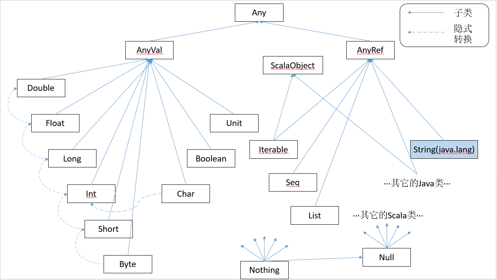

# 第11章 Scala的层级

> Scala里，每个类都继承自通用的名为Any的超类。因为所有的类都是Any的子类，所以定义在Any类的方法就是“共同的”方法：它们可以被任何对象调用。Scala还在层级的底端定义了一些有趣的类，如Null和Nothing，扮演通用的子类。例如，如同Any是所有其他类的超类，Nothing是所有其他类的子类。

## 11.1 Scala的类层级

根类Any有两个子类：AnyVal和AnyRef。AnyVal是Scala里每个内建值类的父类。有9个这样的值类：Byte、Short、Char、Int、Long、Float、Double、Boolean和Unit。其中前8个都对应到Java的基本类型，它们的值在运行时表示成Java的基本类型的值。Scala里这些类的实例都写成字面量。不能使用new创造这些类的实例。这一点由一个“小技巧”保证，值类都被定义为既是抽象的又是final的。

另一个值类，Unit，大约对应于Java的void类型；被用作不返回任何有趣结果的方法的结果类型。Unit只有一个实例值。写成`()`。

**注意**：值类的空间是平等的，所有的值类都是`scala.AnyVal`的子类型，但是它们不是其他类的子类。但是不同的值类类型之间可以隐式地相互转换。例如，需要的时候，类`scala.Int`的实例可以自动放宽（通过隐式转换）到类`scala.Long`的实例。

类Any的另一个类是AnyRef。这个是Scala里所有引用类的基类。正如前面提到的，在Java平台上AnyRef实际就是类`java.lang.Object`的别名。因此Java里写的类和Scala里写的都继承自AnyRef。你可以认为`java.lang.Object`是Java平台上实现AnyRef的方式。因此，尽管Java平台上的Scala程序里Object和AnyRef的使用是可交换的，推荐的风格是在任何地方都只使用AnyRef。

Scala类与Java类的不同在于它们还继承自一个名为ScalaObject的特质。是想要通过ScalaObject包含的Scala编译器定义和实现的方法让Scala程序的执行更高效。到现在为止，ScalaObject只包含一个方法，名为`$tag`，在内部使用加速模式匹配。

## 11.2 原始类型是如何实现的

## 11.3 底层类型
在类型层级图的底部你看到两个类`scala.Null`和`scala.Nothing`。它们是用统一的方式处理Scala面向对象类型系统的某些“边界情况”的特殊类型。

Null类是null引用对象的类型，它是每个引用类（就是说，每个继承自AnyRef的类）的子类。Null不兼容值类型。例如，不能把null值赋值给整数变量。

Nothing类型在Scala的类层级的最底端；它是任何其他类型的子类型。然而，根本没有这个类型的任何值。

## 11.4 小结

