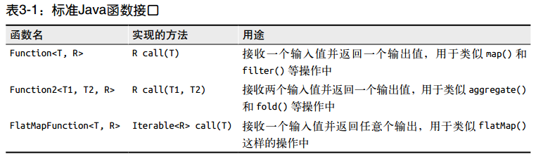

# Spark快速大数据分析
> 书名：Spark快速大数据分析  
> ISBN：978\-7\-115\-40309\-4  
> 出版社：人民邮电出版社

# 第1章 Spark数据分析导论

## 1.1 Spark是什么
Spark 是一个用来实现快速而通用的集群计算的平台。

在速度方面， Spark 扩展了广泛使用的 MapReduce 计算模型，而且高效地支持更多计算模式，包括交互式查询和流处理。 在处理大规模数据集时，速度是非常重要的。速度快就意味着我们可以进行交互式的数据操作， 否则我们每次操作就需要等待数分钟甚至数小时。Spark 的一个主要特点就是能够在内存中进行计算， 因而更快。不过即使是必须在磁盘上进行的复杂计算， Spark 依然比 MapReduce 更加高效。

总的来说， Spark 适用于各种各样原先需要多种不同的分布式平台的场景，包括批处理、迭代算法、交互式查询、流处理。通过在一个统一的框架下支持这些不同的计算， Spark使我们可以简单而低耗地把各种处理流程整合在一起。而这样的组合，在实际的数据分析过程中是很有意义的。 不仅如此， Spark 的这种特性还大大减轻了原先需要对各种平台分别管理的负担。

Spark 所提供的接口非常丰富。 除了提供基于 Python、 Java、 Scala 和 SQL 的简单易用的API 以及内建的丰富的程序库以外， Spark 还能和其他大数据工具密切配合使用。例如，Spark 可以运行在 Hadoop 集群上，访问包括 Cassandra 在内的任意 Hadoop 数据源。

## 1.2 一个大一统的软件栈
Spark 项目包含多个紧密集成的组件。 Spark 的核心是一个对由很多计算任务组成的、运行在多个工作机器或者是一个计算集群上的应用进行调度、 分发以及监控的计算引擎。由于Spark 的核心引擎有着速度快和通用的特点， 因此 Spark 还支持为各种不同应用场景专门设计的高级组件，比如 SQL 和机器学习等。这些组件关系密切并且可以相互调用， 这样你就可以像在平常软件项目中使用程序库那样，组合使用这些的组件。

各组件间密切结合的设计原理有这样几个优点。 首先，软件栈中所有的程序库和高级组件都可以从下层的改进中获益。 比如，当 Spark 的核心引擎新引入了一个优化时， SQL 和机器学习程序库也都能自动获得性能提升。 其次，运行整个软件栈的代价变小了。不需要运行 5 到 10 套独立的软件系统了，一个机构只需要运行一套软件系统即可。这些代价包括系统的部署、 维护、测试、支持等。这也意味着 Spark 软件栈中每增加一个新的组件，使用 Spark 的机构都能马上试用新加入的组件。这就把原先尝试一种新的数据分析系统所需要的下载、部署并学习一个新的软件项目的代价简化成了只需要升级 Spark。

最后，密切结合的原理的一大优点就是，我们能够构建出无缝整合不同处理模型的应用。例如，利用 Spark， 你可以在一个应用中实现将数据流中的数据使用机器学习算法进行实时分类。与此同时，数据分析师也可以通过 SQL 实时查询结果数据，比如将数据与非结构化的日志文件进行连接操作。 不仅如此，有经验的数据工程师和数据科学家还可以通过Python shell 来访问这些数据，进行即时分析。其他人也可以通过独立的批处理应用访问这些数据。 IT 团队始终只需要维护一套系统即可。

Spark 的各个组件如图 1-1 所示，下面来依次简要介绍它们。  


### 1.2.1 Spark Core
Spark Core 实现了 Spark 的基本功能，包含任务调度、内存管理、错误恢复、与存储系统交互等模块。 Spark Core 中还包含了对弹性分布式数据集（resilient distributed dataset，简称 RDD） 的 API 定义。 RDD 表示分布在多个计算节点上可以并行操作的元素集合，是Spark 主要的编程抽象。 Spark Core 提供了创建和操作这些集合的多个 API。

### 1.2.2 Spark SQL
Spark SQL 是 Spark 用来操作结构化数据的程序包。通过 Spark SQL，我们可以使用 SQL或者 Apache Hive 版本的 SQL 方言（HQL）来查询数据。 Spark SQL 支持多种数据源，比如 Hive 表、 Parquet 以及 JSON 等。除了为 Spark 提供了一个 SQL 接口， Spark SQL 还支持开发者将 SQL 和传统的 RDD 编程的数据操作方式相结合，不论是使用 Python、 Java 还是 Scala， 开发者都可以在单个的应用中同时使用 SQL 和复杂的数据分析。通过与 Spark所提供的丰富的计算环境进行如此紧密的结合， Spark SQL 得以从其他开源数据仓库工具中脱颖而出。 Spark SQL 是在 Spark 1.0 中被引入的。

在 Spark SQL 之前，加州大学伯克利分校曾经尝试修改 Apache Hive 以使其运行在 Spark上，当时的项目叫作 Shark。 现在，由于 Spark SQL 与 Spark 引擎和 API 的结合更紧密，Shark 已经被 Spark SQL 所取代。

### 1.2.3 Spark Streaming
Spark Streaming 是 Spark 提供的对实时数据进行流式计算的组件。比如生产环境中的网页服务器日志，或是网络服务中用户提交的状态更新组成的消息队列，都是数据流。Spark Streaming提供了用来操作数据流的 API，并且与 Spark Core 中的 RDD API高度对应。这样一来，程序员编写应用时的学习门槛就得以降低，不论是操作内存或硬盘中的数据，还是操作实时数据流，程序员都更能应对自如。从底层设计来看，Spark Streaming支持与Spark Core同级别的容错性、吞吐量以及可伸缩性。

### 1.2.4 MLlib
Spark 中还包含一个提供常见的机器学习（ML）功能的程序库，叫作 MLlib。 MLlib 提供了很多种机器学习算法， 包括分类、回归、聚类、协同过滤等，还提供了模型评估、数据导入等额外的支持功能。 MLlib 还提供了一些更底层的机器学习原语，包括一个通用的梯度下降优化算法。所有这些方法都被设计为可以在集群上轻松伸缩的架构。

### 1.2.5 GraphX
GraphX是用来操作图（比如社交网络的朋友关系图）的程序库，可以进行并行的图计算。与Spark Streaming和Spark SQL类似，GraphX也扩展了Spark的RDD API，能用来创建一个顶点和边都包含任意属性的有向图。GraphX还支持针对图的各种操作（比如进行图分割的subgraph和操作所有顶点的mapVertices），以及一些常用图算法（比如PageRank和三角计数）。

### 1.2.6 集群管理器
就底层而言， Spark 设计为可以高效地在一个计算节点到数千个计算节点之间伸缩计算。为了实现这样的要求， 同时获得最大灵活性，Spark支持在各种集群管理器（cluster manager）上运行，包括 Hadoop YARN、Apache Mesos，以及Spark自带的一个简易调度器，叫作独立调度器。如果要在没有预装任何集群管理器的机器上安装 Spark，那么Spark自带的独立调度器可以让你轻松入门；而如果已经有了一个装有Hadoop YARN或Mesos的集群，通过Spark对这些集群管理器的支持，你的应用也同样能运行在这些集群上。第7章会详细探讨这些不同的选项以及如何选择合适的集群管理器。

**注意**：Spark不仅可以将任何Hadoop分布式文件系统（HDFS）上的文件读取为分布式数据集，也可以支持其他支持Hadoop接口的系统，比如本地文件、亚马逊S3、Cassandra、Hive、HBase等。我们需要弄清楚的是，Hadoop并非Spark的必要条件，Spark支持任何实现了 Hadoop 接口的存储系统。Spark支持的Hadoop输入格式包括文本文件、SequenceFile、Avro、Parquet等。我们会在第5章讨论读取和存储时详细介绍如何与这些数据源进行交互。

# 第2章 Spark下载与入门
官网： [http://spark.apache.org](http://spark.apache.org)

**注意事项**
* Windows用户如果把Spark安装到带有空格的路径下，可能会遇到一些问题。所以我们需要把Spark安装到不带空格的路径下，比如`C:\spark`这样的目录中。
* 你不需要安装 Hadoop，不过如果你已经有了一个 Hadoop集群或安装好的HDFS，请下载对应版本的Spark。你可以在[http://spark.apache.org/downloads.html](http://spark.apache.org/downloads.html)里选择所需要的包类型，这会导致下载得到的文件名略有不同。也可以选择从源代码直接编译。你可以从GitHub上下载最新代码，也可以在下载页面上选择包类型为“Source Code”（源代码）进行下载。
* 在Spark中，我们通过对分布式数据集的操作来表达我们的计算意图，这些计算会自动地在集群上并行进行。这样的数据集被称为弹性分布式数据集（resilient distributed dataset），简称RDD。RDD是Spark对分布式数据和计算的基本抽象。
* 退出任一shell，按`Ctrl-D`。

## 2.3 Spark核心概念简介
从上层来看， 每个 Spark 应用都由一个驱动器程序（driver program）来发起集群上的各种并行操作。驱动器程序包含应用的 main 函数，并且定义了集群上的分布式数据集，还对这些分布式数据集应用了相关操作。在前面的例子里，实际的驱动器程序就是Spark shell本身，你只需要输入想要运行的操作就可以了。

驱动器程序通过一个SparkContext对象来访问Spark。这个对象代表对计算集群的一个连接。shell启动时已经自动创建了一个SparkContext对象，是一个叫作sc的变量。我们可以通过例2\-3中的方法尝试输出sc来查看它的类型。

一旦有了SparkContext，你就可以用它来创建RDD。调用`sc.textFile()`可以来创建一个代表文件中各行文本的RDD。我们可以在这些行上进行各种操作，比如`count()`。

要执行这些操作，驱动器程序一般要管理多个执行器（executor）节点。比如，如果我们在集群上运行`count()`操作，那么不同的节点会统计文件的不同部分的行数。由于我们刚才是在本地模式下运行Spark shell，因此所有的工作会在单个节点上执行，但你可以将这个shell连接到集群上来进行并行的数据分析。图2\-3展示了Spark 如何在一个集群上运行。  


# 第3章 RDD编程
> 本章介绍Spark对数据的核心抽象——弹性分布式数据集（Resilient Distributed Dataset，简称RDD）。RDD其实就是分布式的元素集合。在Spark中，对数据的所有操作不外乎创建RDD、转化已有RDD以及调用RDD操作进行求值。而在这一切背后，Spark会自动将RDD中的数据分发到集群上，并将操作并行化执行。

## 3.1 RDD基础
Spark中的RDD就是一个不可变的分布式对象集合。每个RDD都被分为多个分区，这些分区运行在集群中的不同节点上。RDD可以包含Python、Java、Scala中任意类型的对象，甚至可以包含用户自定义的对象。

用户可以使用两种方法创建RDD：读取一个外部数据集，或在驱动器程序里分发驱动器程序中的对象集合（比如list和set）。我们在本书前面的章节中已经见过使用`SparkContext.textFile()`来读取文本文件作为一个字符串RDD的示例，如例3\-1所示。
```
例3-1：在Python中使用textFile()创建一个字符串的 RDD
>>> lines = sc.textFile("README.md")
```
创建出来后，RDD支持两种类型的操作：转化操作（transformation）和行动操作（action）。转化操作会由一个RDD生成一个新的RDD。例如，根据谓词匹配情况筛选数据就是一个常见的转化操作。在我们的文本文件示例中，我们可以用筛选来生成一个只存储包含单词Python的字符串的新的RDD，如例3\-2所示。
```
例 3-2：调用转化操作filter()
>>> pythonLines = lines.filter(lambda line: "Python" in line)
```
另一方面，行动操作会对RDD计算出一个结果，并把结果返回到驱动器程序中，或把结果存储到外部存储系统（如HDFS）中。`first()`就是我们之前调用的一个行动操作，它会返回RDD的第一个元素，如例3\-3所示。
```
例 3-3：调用first()行动操作
>>> pythonLines.first()
```
转化操作和行动操作的区别在于Spark计算RDD的方式不同。虽然你可以在任何时候定义新的RDD，但Spark只会惰性计算这些RDD。它们只有第一次在一个行动操作中用到时，才会真正计算。这种策略刚开始看起来可能会显得有些奇怪，不过在大数据领域是很有道理的。比如，看看例3\-2和例3\-3，我们以一个文本文件定义了数据，然后把其中包含Python的行筛选出来。如果Spark在我们运行`lines = sc.textFile(...)`时就把文件中所有的行都读取并存储起来，就会消耗很多存储空间，而我们马上就要筛选掉其中的很多数据。相反，一旦Spark了解了完整的转化操作链之后，它就可以只计算求结果时真正需要的数据。事实上，在行动操作`first()`中，Spark只需要扫描文件直到找到第一个匹配的行为止，而不需要读取整个文件。

最后，默认情况下，Spark的RDD会在你每次对它们进行行动操作时重新计算。如果想在多个行动操作中重用同一个 RDD，可以使用`RDD.persist()`让Spark把这个RDD缓存
下来。我们可以让Spark把数据持久化到许多不同的地方，可用的选项会在表3\-6中列出。在第一次对持久化的RDD计算之后，Spark会把RDD的内容保存到内存中（以分区方式存储到集群中的各机器上），这样在之后的行动操作中，就可以重用这些数据了。我们也可以把RDD缓存到磁盘上而不是内存中。默认不进行持久化可能也显得有些奇怪，不过这对于大规模数据集是很有意义的：如果不会重用该RDD，我们就没有必要浪费存储空间，Spark可以直接遍历一遍数据然后计算出结果。

在实际操作中，你会经常用`persist()`来把数据的一部分读取到内存中，并反复查询这部分数据。例如，如果我们想多次对README文件中包含Python的行进行计算，就可以写出如例3\-4所示的脚本。
```
例3-4：把RDD持久化到内存中
>>> pythonLines.persist
>>> pythonLines.count()
2
>>> pythonLines.first()
u'## Interactive Python Shell'
```
总的来说，每个Spark程序或shell会话都按如下方式工作。
1. 从外部数据创建出输入RDD。
2. 使用诸如`filter()`这样的转化操作对RDD进行转化，以定义新的RDD。
3. 告诉Spark对需要被重用的中间结果RDD执行`persist()`操作。
4. 使用行动操作（例如`count()`和`first()`等）来触发一次并行计算，Spark会对计算进行优化后再执行。

**注意**：  
`cache()`与使用默认存储级别调用`persist()`是一样的。

## 3.2 创建RDD
Spark创建RDD的方式：
1. 读取外部数据集
2. 在驱动器程序中对一个集合进行并行化。

创建RDD最简单的方式是把程序中一个已有的集合传给SparkContext的parallize()方法。这种方式在学习Spark时非常有用。

更常用的方法是从外部存储中读取数据来创建RDD。外部数据集的读取会在第5章详细介绍。

## 3.2 RDD操作
我们已经讨论过，RDD支持两种操作：转化操作和行动操作。RDD的转化操作是返回一个新的RDD的操作，比如map()和filter()，而行动操作则是向驱动器程序返回结果或把结果写入行动操作的方式很不一样，因此理解你正在进行的操作的类型是很重要的。如果对于一个特定的函数是属于转化操作还是行动操作感到困惑，你可以看看它的返回值类型：转化操作返回的是RDD，而行动操作返回的是其他的数据类型。

### 3.3.1 转化操作
RDD的转化操作是返回新的RDD的操作。转化出来的RDD是惰性求值的，只有在行动操作中用到这些RDD时才会被计算。许多转化操作都是针对各个元素的，也就是说，这些转化操作每次只会操作RDD中的一个元素。不过并不是所有的转化操作都是这样的。

转化操作可以操作任意数量的输入RDD。

通过转化操作，你从已有的RDD中派生出新的RDD，Spark会使用谱系图来记录这些不同RDD之间的依赖关系。Spark需要用这些信息来按需计算每个RDD，也可以靠谱系图在持久化的RDD丢失部分数据时恢复所丢失的数据。

### 3.3.2 行动操作
行动操作是第二种类型的RDD操作，它们会把最终天求得的结果返回到驱动器程序，或者写入外部存储器系统中。由于行动操作需要生成实际的输出，它们会强制那些求值用到的RDD的转化操作。

在驱动器程序中使用take()获取RDD中的少量元素，collect()函数获取RDD中的所有元素，只有当你的整个数据集能在单台机器的内存中放得下时，才能使用collect()，因此，collect()不能用在大规模数据集上。

### 3.3.3 惰性求值
RDD的转化操作都是惰性求值的。这意味着在被调用行动操作之前Spark不会开始计算。惰性求值意味着当我们对RDD调用转化操作（例如调用`map()`）时，操作不会立即执行。相反，Spark会在内部记录下所要求执行的操作的相关信息。我们不应该把RDD看作存放着特定数据的数据集，而最好把每个RDD当作我们通过转化操作构建出来的、记录如何计算数据的指令列表。把数据读取到RDD的操作也同样是惰性的。因此，当我们调用`sc.textFile()`时，数据并没有读取进来，而是在必要时才会读取。和转化操作一样的是，读取数据的操作也有可能会多次执行。

## 3.4 向Spark会传递函数
Spark的大部分转化操作和一部分行动操作，都需要依赖用户传递的函数来计算。在我们支持的三种主要语言中，向Spark传递函数的方式略有区别。

### 3.4.1 Python
在Python中有三种方式来把函数传递给Spark。
* 传递较短的函数时，可以使用lambda表达式传递
* 传递顶层函数
* 定义局部函数

**注意**：传递函数时需要小心一点是，Python会在你不经意间把函数所在的对象也序列化传出去。当你传递的对象是某个对象的成员，或者包含了对某个对象中一个字段的引用时（例如`self.field`），Spark就会把整个对象发到工作节点上，这可能比你想传递的东西大得多。  


### 3.4.2 Scala
在Scala中，我们可以把定义的内联函数、方法的引用或静态方法传递给Spark，就像Scala的其他函数式API一样。我们还要考虑其他一些细节，比如所传递的函数及其引用的数据需要是可序列化的（实现了Java的Serializable接口）。除此以外，与Python类似，传递一个对象的方法或者字段时，会包含对整个对象的引用。这在Scala中不是那么明显，毕竟我们不会像Python那样必须用self写出那些引用。


**注意**：如果在Scala中出现了NotSerializableException，通常问题就在于我们传递了一个不可序列化的类中的函数或字段。记住，传递局部可序列化变量或顶级对象中的函数始终是安全的。

### 3.4.3 Java
在Java中，函数需要作为实现了Spark的`org.apache.spark.api.java.function`包中的任一函数接口的对象来传递。根据不同的返回类型，我们定义了一些不同的接口。我们把最基本的一些函数接口列在表3-1中，同时不介绍了一些其它函数接口，在需要返回特殊值类型（比如键值对）的数据时使用，参见3.5.2节中的“java”一节。


可以把我们的函数类内联定义为使用匿名内部类，也可以创建一个具名类。具体风格的选择取决于个人偏好。不过我们发现顶级具名类通常在组织大型程序时显得比较清晰。使用顶级函数的另一个好处在于你可以给它们的构造函数添加参数。

在Java 8中，你也可以使用lambda表达式来简洁地实现函数接口。由于在本书写作时，Java 8仍然相对比较新，我们的示例就使用了之前版本的Java，以更啰嗦的语法来定义函数类。

**注意**：匿名内部类和lambda表达式都可以引用方法中封装的任意final变量，因此你可以像在Python和Scala中一样把这些变量传递给Spark。

## 3.5 常见的转化操作和行动操作
### 3.5.1 基本RDD
1. 针对各个元素的转化操作
   你很可能会用到的两个最常用的转化操作是map()和 filter()（见图 3-2）。转化操作map()接收一个函数，把这个函数用于RDD中的每个元素，将函数的返回结果作为结果RDD中对应元素的值。而转化操作filter()则接收一个函数，并将 RDD 中满足该函数的元素放入新的RDD中返回。  
     
   有时候，我们希望对每个输入元素生成多个输出元素。实现该功能的操作叫作flatMap()。和map()类似，我们提供给flatMap()的函数被分别应用到了输入RDD的每个元素上。不过返回的不是一个元素，而是一个返回值序列的迭代器。输出的 RDD 倒不是由迭代器组成的。我们得到的是一个包含各个迭代器可访问的所有元素的RDD。  
   
2. 伪集合操作
   尽管RDD本身不是严格意义上的集合，但它也支持许多数学上的集合操作，比如合并和相交操作。图3-4展示了四种操作。注意，这些操作都要求操作的RDD是相同数据类型的。  
   
   * 我们的RDD中最常缺失的集合属性是元素的唯一性，因为常常有重复的元素。如果只要唯一的元素，我们可以使用`RDD.distinct()`转化操作来生成一个只包含不同元素的新RDD。不过需要注意，`distinct()`操作的开销很大，因为它需要将所有数据通过网络进行混洗（shuffle），以确保每个元素都只有一份。第4章会详细介绍数据混洗，以及如何避免数据混洗。
   * 最简单的集合操作是`union(other)`，它会返回一个包含两个RDD中所有元素的RDD。这在很多用例下都很有用，比如处理来自多个数据源的日志文件。与数学中的`union()`操作不同的是，如果输入的RDD中有重复数据，Spark的`union()`操作也会包含这些重复数据（如有必要，我们可以通过`distinct()`实现相同的效果）。
   * Spark还提供了`intersection(other)`方法，只返回两个RDD中都有的元素。`intersection()`在运行时也会去掉所有重复的元素（单个RDD内的重复元素也会一起移除）。尽管`intersection()`与`union()`的概念相似，`intersection()`的性能却要差很多，因为它需要通过网络混洗数据来发现共有的元素。
   * 有时我们需要移除一些数据。`subtract(other)`函数接收另一个RDD作为参数，返回一个由只存在于第一个RDD中而不存在于第二个RDD中的所有元素组成的RDD。和`intersection()`一样，它也需要数据混洗。
   * 我们也可以计算两个RDD的笛卡儿积，如图3-5所示。 `cartesian(other)`转化操作会返回所有可能的`(a, b)`对，其中a是源RDD中的元素，而b则来自另一个RDD。笛卡儿积在我们希望考虑所有可能的组合的相似度时比较有用，比如计算各用户对各种产品的预期兴趣程度。我们也可以求一个RDD与其自身的笛卡儿积，这可以用于求用户相似度的应用中。不过要特别注意的是，求大规模RDD的笛卡儿积开销巨大。  
     
   * 表3-2和表3-3总结了这些常见的RDD转化操作。  
       
     
3. 行动操作
   * 你很有可能会用到基本RDD上最常见的行动操作`reduce()`。它接收一个函数作为参数，这个函数要操作两个RDD的元素类型的数据并返回一个同样类型的新元素。一个简单的例子就是函数`+`，可以用它来对我们的RDD进行累加。使用`reduce()`，可以很方便地计算出RDD中所有元素的总和、元素的个数，以及其他类型的聚合操作。
   * `fold()`和`reduce()`都要求函数的返回值类型需要和我们所操作的RDD中的元素类型相同。这很符合像sum这种操作的情况。但有时我们确实需要返回一个不同类型的值。例如，在计算平均值时，需要记录遍历过程中的计数以及元素的数量，这就需要我们返回一个二元组。可以先对数据使用`map()`操作，来把元素转为该元素和1的二元组，也就是我们所希望的返回类型。这样`reduce()`就可以以二元组的形式进行归约了。
   * `aggregate()`函数则把我们从返回值类型必须与所操作的RDD类型相同的限制中解放出来。与`fold()`类似，使用`aggregate()`时，需要提供我们期待返回的类型的初始值。然后通过一个函数把RDD中的元素合并起来放入累加器。考虑到每个节点是在本地进行累加的，最终，还需要提供第二个函数来将累加器两两合并。
   * RDD的一些行动操作会以普通集合或者值的形式将RDD的部分或全部数据返回驱动器程序中。把数据返回驱动器程序中最简单、最常见的操作是`collect()`，它会将整个RDD的内容返回。`collect()`通常在单元测试中使用，因为此时RDD的整个内容不会很大，可以放在内存中。使用`collect()`使得RDD的值与预期结果之间的对比变得很容易。由于需要将数据复制到驱动器进程中，`collect()`要求所有数据都必须能一同放入单台机器的内存中。
   * `take(n)`返回RDD中的n个元素，并且尝试只访问尽量少的分区，因此该操作会得到一个不均衡的集合。需要注意的是，这些操作返回元素的顺序与你预期的可能不一样。
   * 这些操作对于单元测试和快速调试都很有用，但是在处理大规模数据时会遇到瓶颈。如果为数据定义了顺序，就可以使用`top()`从RDD中获取前几个元素。`top()`会使用数据的默认顺序，但我们也可以提供自己的比较函数，来提取前几个元素。
   * 有时需要在驱动器程序中对我们的数据进行采样。`takeSample(withReplacement, num, seed)`函数可以让我们从数据中获取一个采样，并指定是否替换。
   * 有时我们会对RDD中的所有元素应用一个行动操作，但是不把任何结果返回到驱动器程序中，这也是有用的。比如可以用JSON格式把数据发送到一个网络服务器上，或者把数据存到数据库中。不论哪种情况，都可以使用`foreach()`行动操作来对RDD中的每个元素进行操作，而不需要把RDD发回本地。
   * 关于基本RDD上的更多标准操作，我们都可以从其名称推测出它们的行为。`count()`用来返回元素的个数，而`countByValue()`则返回一个从各值到值对应的计数的映射表。表3\-4总结了这些行动操作。  
     

### 3.5.2 在不同的RDD类型间转换
有些函数只能用于特定类型的RDD，比如`mean()`和`variance()`只能用在数值RDD上，而`join()`只能用在键值对RDD上。我们会在第6章讨论数值RDD的专门函数，在第4章讨论键值对RDD的专有操作。在Scala和Java中，这些函数都没有定义在标准的RDD类中，所以要访问这些附加功能，必须要确保获得了正确的专用RDD类。
1. Scala  
   在Scala中，将RDD转为有特定函数的RDD（比如在`RDD[Double]`上进行数值操作）是由隐式转换来自动处理的。2.4.1节中提到过，我们需要加上`import org.apache.spark.SparkContext._`来使用这些隐式转换。你可以在SparkContext对象的[Scala文档](http://spark.apache.org/docs/latest/api/scala/index.html#org.apache.spark.SparkContext$)中查看所列出的隐式转换。这些隐式转换可以隐式地将一个RDD转为各种封装类，比如`DoubleRDDFunctions`（数值数据的RDD）和`PairRDDFunctions`（键值对RDD），这样我们就有了诸如`mean()`和`variance()`之类的额外的函数。  
   隐式转换虽然强大，但是会让阅读代码的人感到困惑。如果你对RDD调用了像`mean()`这样的函数，可能会发现RDD类的[Scala文档](http://spark.apache.org/docs/latest/api/scala/index.html#org.apache.spark.rdd.RDD)中根本没有`mean()`函数。调用之所以能够成功，是因为隐式转换可以把`RDD[Double]`转为`DoubleRDDFunctions`。当我们在`Scala`文档中查找函数时，不要忘了那些封装的专用类中的函数。
2. Java  
   在Java中，各种RDD的特殊类型间的转换更为明确。Java中有两个专门的类`JavaDoubleRDD`和`JavaPairRDD`，来处理特殊类型的RDD，这两个类还针对这些类型提供了额外的函数。这让你可以更加了解所发生的一切，但是也显得有些累赘。  
   要构建出这些特殊类型的RDD，需要使用特殊版本的类来替代一般使用的Function类。如果要从T类型的RDD创建出一个DoubleRDD，我们就应当在映射操作中使用`DoubleFunction<T>`来替代`Function<T, Double>`。表3\-5展示了一些特殊版本的函数类及其用法。  
   此外，我们也需要调用 RDD 上的一些别的函数（因此不能只是创建出一个`DoubleFunction`然后把它传给`map()`）。当需要一个`DoubleRDD`时，我们应当调用`mapToDouble()`来替代`map()`，跟其他所有函数所遵循的模式一样。  
   
3. Python
   Python的API结构与Java和Scala有所不同。在Python中，所有的函数都实现在基本的RDD类中，但如果操作对应的RDD数据类型不正确，就会导致运行时错误。

## 3.6 持久化（缓存）
如前所述，Spark RDD是惰性求值的，而有时我们希望能多次使用同一个RDD。如果简单地对RDD调用行动操作，Spark每次都会重算RDD以及它的所有依赖。这在迭代算法中消耗格外大，因为迭代算法常常会多次使用同一组数据。

为了避免多次计算同一个RDD，可以让Spark对数据进行持久化。当我们让Spark持久化存储一个 RDD时，计算出RDD的节点会分别保存它们所求出的分区数据。如果一个有持久化数据的节点发生故障，Spark会在需要用到缓存的数据时重算丢失的数据分区。如果希望节点故障的情况不会拖累我们的执行速度，也可以把数据备份到多个节点上。

出于不同的目的，我们可以为RDD选择不同的持久化级别（如表3\-6所示）。在Scala（见
例3\-40）和Java中，默认情况下`persist()`会把数据以序列化的形式缓存在JVM的堆空间中。在Python中，我们会始终序列化要持久化存储的数据，所以持久化级别默认值就是以序列化后的对象存储在JVM堆空间中。当我们把数据写到磁盘或者堆外存储上时，也总是使用序列化后的数据。


**注意**：我们在第一次对这个RDD调用行动操作前就调用了`persist()`方法。`persist()`调用本身不会触发强制求值。

如果要缓存的数据太多，内存中放不下，Spark会自动利用最近最少使用（LRU）的缓存策略把最老的分区从内存中移除。对于仅把数据存放在内存中的缓存级别，下一次要用到已经被移除的分区时，这些分区就需要重新计算。但是对于使用内存与磁盘的缓存级别的分区来说，被移除的分区都会写入磁盘。不论哪一种情况，都不必担心你的作业因为缓存了太多数据而被打断。不过，缓存不必要的数据会导致有用的数据被移出内存，带来更多重算的时间开销。

最后，RDD还有一个方法叫作`unpersist()`，调用该方法可以手动把持久化的RDD从缓存中移除。

# 第4章 键值对操作
> 键值对RDD是Spark中许多操作所需要的常见数据类型。本章就来介绍如何操作键值对RDD。键值对RDD通常用来进行聚合计算。我们一般要先通过一些初始 ETL（抽取、转化、装载）操作来将数据转化为键值对形式。键值对RDD提供了一些新的操作接口（比如统计每个产品的评论，将数据中键相同的分为一组，将两个不同的RDD进行分组合并等）。
>
> 本章也会讨论用来让用户控制键值对RDD在各节点上分布情况的高级特性： 分区。有时，使用可控的分区方式把常被一起访问的数据放到同一个节点上，可以大大减少应用的通信开销。这会带来明显的性能提升。我们会使用PageRank算法来演示分区的作用。为分布式数据集选择正确的分区方式和为本地数据集选择合适的数据结构很相似——在这两种情况下，数据的分布都会极其明显地影响程序的性能表现。

## 4.1 动机
Spark为包含键值对类型的RDD提供了一些专有的操作。这些RDD被称为pairRDD1。PairRDD是很多程序的构成要素， 因为它们提供了并行操作各个键或跨节点重新进行数据分组的操作接口。例如，pair RDD提供`reduceByKey()`方法，可以分别归约每个键对应的数据，还有`join()`方法，可以把两个RDD中键相同的元素组合到一起，合并为一个RDD。我们通常从一个RDD中提取某些字段（例如代表事件时间、用户ID或者其他标识符的字段），并使用这些字段作为pair RDD操作中的键。

## 4.2 创建Pair RDD
在Spark中有很多种创建pair RDD的方式。第5章会讲到，很多存储键值对的数据格式会在读取时直接返回由其键值对数据组成的pair RDD。此外，当需要把一个普通的RDD转为pair RDD时，可以调用`map()`函数来实现，传递的函数需要返回键值对。后面会展示如何将由文本行组成的RDD转换为以每行的第一个单词为键的pair RDD。构建键值对RDD的方法在不同的语言中会有所不同。在Python中，为了让提取键之后的数据能够在函数中使用，需要返回一个由二元组组成的RDD。在Scala中，为了让提取键之后的数据能够在函数中使用，同样需要返回二元组。隐式转换可以让二元组RDD支持附加的键值对函数。Java没有自带的二元组类型，因此Spark的Java API让用户使用`scala.Tuple2`类来创建二元组。这个类很简单：Java用户可以通过`new Tuple2(elem1, elem2)`来创建一个新的二元组，并且可以通过`._1()`和`._2()`方法访问其中的元素。Java用户还需要调用专门的Spark函数来创建pair RDD。例如，要使用`mapToPair()`函数来代替基础版的`map()`函数，这在3.5.2节中的“Java”一节有过更详细的讨论。当用Scala和Python从一个内存中的数据集创建pair RDD时，只需要对这个由二元组组成的集合调用`SparkContext.parallelize()`方法。而要使用Java从内存数据集创建pair RDD的话，则需要使用`SparkContext.parallelizePairs()`。

## 4.3 Pair RDD的转化操作
Pair RDD可以使用所有标准RDD上的可用的转化操作。3\.4节中介绍的所有有关传递函数的规则也都同样适用于pair RDD。由于pair RDD中包含二元组，所以需要传递的函数应当操作二元组而不是独立的元素。表4\-1和表4\-2总结了对pair RDD的一些转化操作，在本章会深入介绍。


Pair RDD也还是RDD（元素为Java或Scala中的Tuple2对象或Python中的元组），因此同样支持RDD所支持的函数。

有时，我们只想访问pair RDD的值部分，这时操作二元组很麻烦。由于这是一种常见的使用模式，因此Spark提供了`mapValues(func)`函数，功能类似于`map{case (x, y): (x, func(y))}`。可以在很多例子中使用这个函数。

### 4.3.1 聚合操作
Spark有一组类似的操作，可以组合具有相同键的值。这些操作返回RDD，因此它们是转化操作而不是行动操作。`reduceByKey()`与`reduce()`相当类似；它们都接收一个函数，并使用该函数对值进行合并。`reduceByKey()`会为数据集中的每个键进行并行的归约操作，每个归约操作会将键相同的值合并起来。因为数据集中可能有大量的键，所以`reduceByKey()`没有被实现为向用户程序返回一个值的行动操作。实际上，它会返回一个由各键和对应键归约出来的结果值组成的新的RDD。

`foldByKey()`则与`fold()`相当类似；它们都使用一个与RDD和合并函数中的数据类型相同的零值作为初始值。与`fold()`一样，`foldByKey()`操作所使用的合并函数对零值与另一个元素进行合并，结果仍为该元素。

`combineByKey()`是最为常用的基于键进行聚合的函数。大多数基于键聚合的函数都是用它实现的。和`aggregate()`一样，`combineByKey()`可以让用户返回与输入数据的类型不同的返回值。

要理解`combineByKey()`，要先理解它在处理数据时是如何处理每个元素的。由于`combineByKey()`会遍历分区中的所有元素，因此每个元素的键要么还没有遇到过，要么就和之前的某个元素的键相同。

如果这是一个新的元素，`combineByKey()`会使用一个叫作`createCombiner()`的函数来创建那个键对应的累加器的初始值。需要注意的是，这一过程会在每个分区中第一次出现各个键时发生，而不是在整个RDD中第一次出现一个键时发生。

如果这是一个在处理当前分区之前已经遇到的键，它会使用`mergeValue()`方法将该键的累加器对应的当前值与这个新的值进行合并。

由于每个分区都是独立处理的，因此对于同一个键可以有多个累加器。如果有两个或者更
多的分区都有对应同一个键的累加器，就需要使用用户提供的`mergeCombiners()`方法将各
个分区的结果进行合并。

**注意**：如果已知数据在进行`combineByKey()`时无法从map端聚合中获益的话，可以禁用它。例如，由于聚合函数（追加到一个队列）无法在map端聚合时节约任何空间，`groupByKey()`就把它禁用了。如果希望禁用map端组合，就需要指定分区方式。就目前而言，你可以通过传递`rdd.partitioner`来直接使用源RDD的分区方式。

### 4.3.2 数据分组


### 4.3.3 连接


### 4.3.4 数据排序


## 4.4 Pair RDD的行动的操作

## 4.5 数据分区（进阶）

### 4.5.1 获致RDD的分区方式

### 4.5.2 从分区中获益的操作

### 4.5.3 影响分区方式的操作

### 4.5.4 示例：PageRank

### 4.5.5 自定义分区方式


# 第5章 数据读取与保存

# 第6章 Spark编程进阶

# 第7章 在集群上运行Spark

# 第8章 Spark调优与调试

# 第9章 Spark SQL

# 第10章 Spark Streaming

# 第11章 基于MLlib的机器学习
