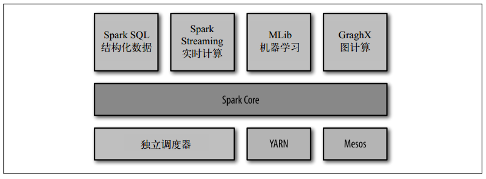

# Spark
> Spark 是一个用来实现快速而通用的集群计算的平台。

## Spark的组件
Spark组件

1. Spark Core

Spark Core 实现了 Spark 的基本功能，包含任务调度、内存管理、错误恢复、与存储系统交互等模块。 
Spark Core 中还包含了对弹性分布式数据集（resilient distributed dataset，简
称 RDD） 的 API 定义。 RDD 表示分布在多个计算节点上可以并行操作的元素集合，是
Spark 主要的编程抽象。 Spark Core 提供了创建和操作这些集合的多个 API。

2. Spark SQL

Spark SQL 是 Spark 用来操作结构化数据的程序包。通过 Spark SQL，我们可以使用 SQL
或者 Apache Hive 版本的 SQL 方言（HQL）来查询数据。 Spark SQL 支持多种数据源，比
如 Hive 表、 Parquet 以及 JSON 等。除了为 Spark 提供了一个 SQL 接口， Spark SQL 还支
持开发者将 SQL 和传统的 RDD 编程的数据操作方式相结合，不论是使用 Python、 Java 还
是 Scala， 开发者都可以在单个的应用中同时使用 SQL 和复杂的数据分析。通过与 Spark
所提供的丰富的计算环境进行如此紧密的结合， Spark SQL 得以从其他开源数据仓库工具
中脱颖而出。 Spark SQL 是在 Spark 1\.0 中被引入的。

在 Spark SQL 之前，加州大学伯克利分校曾经尝试修改 Apache Hive 以使其运行在 Spark
上，当时的项目叫作 Shark。 现在，由于 Spark SQL 与 Spark 引擎和 API 的结合更紧密，
Shark 已经被 Spark SQL 所取代。

3. Spark Streaming
Spark Streaming 是 Spark 提供的对实时数据进行流式计算的组件。比如生产环境中的网页
服务器日志， 或是网络服务中用户提交的状态更新组成的消息队列，都是数据流。 Spark
Streaming 提供了用来操作数据流的 API， 并且与 Spark Core 中的 RDD API 高度对应。这
样一来，程序员编写应用时的学习门槛就得以降低，不论是操作内存或硬盘中的数据，还
是操作实时数据流， 程序员都更能应对自如。从底层设计来看， Spark Streaming 支持与
Spark Core 同级别的容错性、吞吐量以及可伸缩性。

4. MLlib
Spark 中还包含一个提供常见的机器学习（ML）功能的程序库，叫作 MLlib。 MLlib 提供
了很多种机器学习算法， 包括分类、回归、聚类、协同过滤等，还提供了模型评估、数据
导入等额外的支持功能。 MLlib 还提供了一些更底层的机器学习原语，包括一个通用的梯
度下降优化算法。所有这些方法都被设计为可以在集群上轻松伸缩的架构。

5. GraphX
GraphX 是用来操作图（比如社交网络的朋友关系图）的程序库，可以进行并行的图计算。
与 Spark Streaming 和 Spark SQL 类似， GraphX 也扩展了 Spark 的 RDD API，能用来创建
一个顶点和边都包含任意属性的有向图。 GraphX 还支持针对图的各种操作（比如进行图分割
的 subgraph 和操作所有顶点的 mapVertices），以及一些常用图算法（比如 PageRank和三角计数）。

6.　集群管理器
就底层而言， Spark 设计为可以高效地在一个计算节点到数千个计算节点之间伸缩计
算。为了实现这样的要求， 同时获得最大灵活性， Spark 支持在各种集群管理器（cluster
manager） 上运行， 包括 Hadoop YARN、 Apache Mesos，以及 Spark 自带的一个简易调度
器，叫作独立调度器。 如果要在没有预装任何集群管理器的机器上安装 Spark，那么 Spark
自带的独立调度器可以让你轻松入门； 而如果已经有了一个装有 Hadoop YARN 或 Mesos
的集群，通过 Spark 对这些集群管理器的支持，你的应用也同样能运行在这些集群上。

## RDD（Resilient Distributed Dataset，简称 RDD）

### RDD基础
Spark 中的 RDD 就是一个不可变的分布式对象集合。每个 RDD 都被分为多个分区，这些
分区运行在集群中的不同节点上。 RDD 可以包含 Python、 Java、 Scala 中任意类型的对象，
甚至可以包含用户自定义的对象。

##### 创建RDD：
* 读取一个外部数据集
* 在驱动器程序里分发驱动器程序中的对象集合（比如 list 和 set）。

##### RDD的操作：
* 转化操作：由一个 RDD 生成一个新的 RDD
* 行动操作：会对 RDD 计算出一个结果，并把结果返回到驱动器程序中，或把结果存储到外部存储系统（如HDFS）中。

**区别**：转化操作和行动操作的区别在于 Spark 计算 RDD 的方式不同。虽然你可以在任何时候定
义新的 RDD， 但 Spark 只会惰性计算这些 RDD。 它们只有第一次在一个行动操作中用到
时，才会真正计算。 

默认情况下， Spark 的 RDD 会在你每次对它们进行行动操作时重新计算。如果想
在多个行动操作中重用同一个 RDD， 可以使用 RDD.persist() 让 Spark 把这个 RDD 缓存下来。
我们可以让 Spark 把数据持久化到许多不同的地方。
在第一次对持久化的 RDD 计算之后， Spark 会把 RDD 的内容保存到内存中（以分区方式
存储到集群中的各机器上），这样在之后的行动操作中， 就可以重用这些数据了。我们也
可以把 RDD 缓存到磁盘上而不是内存中。默认不进行持久化可能也显得有些奇怪，不过
这对于大规模数据集是很有意义的： 如果不会重用该 RDD，我们就没有必要浪费存储空
间， Spark 可以直接遍历一遍数据然后计算出结果。

