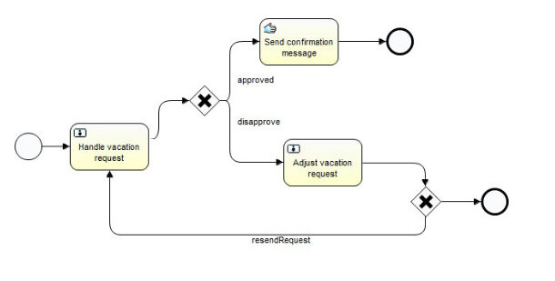

# Activiti
> 工作流(Workflow)，就是“业务过程的部分或整体在计算机应用环境下的自动化”，它主要解决的是“使在多个参与者之间按照某种预定义的规则传递文档、信息或任务的过程自动进行，从而实现某个预期的业务目标，或者促使此目标的实现”。
>
> 工作流管理系统(Workflow Management System, WfMS)是一个软件系统，它完成工作量的定义和管理，并按照在系统中预先定义好的工作流规则进行工作流实例的执行。工作流管理系统不是企业的业务系统，而是为企业的业务系统的运行提供了一个软件的支撑环境。
>
> 工作流管理联盟(WfMC，Workflow Management Coalition)给出的关于工作流管理系统的定义是：工作流管理系统是一个软件系统，它通过执行经过计算的流程定义去支持一批专门设定的业务流程。工作流管理系统被用来定义、管理、和执行工作流程。

# 1. Activiti介绍
Activiti5是由Alfresco软件在2010年5月17日发布的业务流程管理（BPM）框架，它是覆盖了业务流程管理、工作流、服务协作等领域的一个开源的、灵活的、易扩展的可执行流程语言框架。Activiti基于Apache许可的开源BPM平台，创始人Tom Baeyens是JBoss jBPM的项目架构师，它特色是提供了eclipse插件，开发人员可以通过插件直接绘画出业务流程图。



## 1.1 工作流引擎
ProcessEngine对象，这是Activiti工作的核心。负责生成流程运行时的各种实例及数据、监控和管理流程的运行。

## 1.2 BPMN
业务流程建模与标注（Business Process Model and Notation，BPMN) ，描述流程的基本符号，包括这些图元如何组合成一个业务流程图（Business Process Diagram）

## 3.3 数据库
Activiti数据库支持：  
Activiti的后台是有数据库的支持，所有的表都以ACT_开头。 第二部分是表示表的用途的两个字母标识。 用途也和服务的API对应。

* `ACT_RE_*`: RE表示repository。 这个前缀的表包含了流程定义和流程静态资源 （图片，规则，等等）。

* `ACT_RU_*`: RU表示runtime。 这些运行时的表，包含流程实例，任务，变量，异步任务，等运行中的数据。 Activiti只在流程实例执行过程中保存这些数据， 在流程结束时就会删除这些记录。 这样运行时表可以一直很小速度很快。

* `ACT_ID_*`: ID表示identity。 这些表包含身份信息，比如用户，组等等。

* `ACT_HI_*`: HI表示history。 这些表包含历史数据，比如历史流程实例， 变量，任务等等。

* `ACT_GE_*`: 通用数据， 用于不同场景下，如存放资源文件。

## 3.4 配置文件

默认配置文件名称：`activiti.cfg.xml`

## 3.5 日志处理

`logging.properties`

# 4 Activiti HelloWorld

1. 初始化数据库中的数据表

方法一：通过代码方式初始化

```
// 通过代码初始化
public void initActiviti_method1() {
		// 创建ProcessEngine配置
		ProcessEngineConfiguration conf = ProcessEngineConfiguration.createStandaloneProcessEngineConfiguration();

		// 设置数据库
		conf.setJdbcDriver("com.mysql.jdbc.Driver");
		conf.setJdbcUrl("jdbc:mysql://localhost:3306/activiti?useUnicode=true&characterEncoding=utf8");
		conf.setJdbcUsername("root");
		conf.setJdbcPassword("admin");

		// 不创建表(表必须存在)
		// public static final String DB_SCHEMA_UPDATE_FALSE = "false";
		// 先再创建表再删除表
		// public static final String DB_SCHEMA_UPDATE_CREATE_DROP =
		// "create-drop";
		// 如果没有表则创建表
		// public static final String DB_SCHEMA_UPDATE_TRUE = "true";
		conf.setDatabaseSchemaUpdate(ProcessEngineConfiguration.DB_SCHEMA_UPDATE_TRUE);

		ProcessEngine processEngine = conf.buildProcessEngine();

		// 关闭ProcessEngine
		processEngine.close();
	}
```

方法二：通过配置文件初始化

配置文件内容：

```
<beans xmlns="http://www.springframework.org/schema/beans"
	xmlns:context="http://www.springframework.org/schema/context" xmlns:tx="http://www.springframework.org/schema/tx"
	xmlns:xsi="http://www.w3.org/2001/XMLSchema-instance"
	xsi:schemaLocation="http://www.springframework.org/schema/beans http://www.springframework.org/schema/beans/spring-beans.xsd
http://www.springframework.org/schema/context http://www.springframework.org/schema/context/spring-context-2.5.xsd
http://www.springframework.org/schema/tx http://www.springframework.org/schema/tx/spring-tx-3.0.xsd">

	<bean id="dataSource"
		class="org.springframework.jdbc.datasource.SimpleDriverDataSource">
		<property name="driverClass" value="com.mysql.jdbc.Driver" />
		<property name="url"
			value="jdbc:mysql://localhost:3306/activiti?useUnicode=true&amp;useCharacterEncoding=utf8" />
		<property name="username" value="root" />
		<property name="password" value="admin" />
	</bean>

	<bean id="transactionManager"
		class="org.springframework.jdbc.datasource.DataSourceTransactionManager">
		<property name="dataSource" ref="dataSource" />
	</bean>

	<bean id="processEngineConfiguration" class="org.activiti.spring.SpringProcessEngineConfiguration">
		<property name="dataSource" ref="dataSource" />
		<property name="transactionManager" ref="transactionManager" />
		<property name="databaseSchemaUpdate" value="true" />
	</bean>

	<bean id="processEngine" class="org.activiti.spring.ProcessEngineFactoryBean">
		<property name="processEngineConfiguration" ref="processEngineConfiguration" />
	</bean>

</beans>
```

代码：

```
public void initActiviti_method2() {
		ProcessEngine processEngine = ProcessEngineConfiguration
				.createProcessEngineConfigurationFromResource("activiti-content.xml").buildProcessEngine();

		processEngine.close();

	}
```

2. Hello Word 代码
```
	@Test
	// 流程定义
	public void deployProcess() {
		Deployment deployment = processEngine.getRepositoryService() // 与流程定义和布署相关的Service
				.createDeployment() // 创建一个布署对象
				.name("HelloWorld入门程序") // 添加布署的名称
				.addClasspathResource("graph/HelloWorld.bpmn") // 从classpath的意资源中加载,一次只能加载一个文件
				.deploy(); // 完成布署
		System.out.println(deployment.getId()); //
		System.out.println(deployment.getName()); //
	}

	@Test
	// 流程启动
	public void startProcessInstance() {
		ProcessInstance processInstance = processEngine.getRuntimeService() // 与正在执行的流程实例和执行对象相关的Service
				.startProcessInstanceByKey("myProcess"); // 使用流程定义的Key启动流程实例,key对应HelloWorld.bpmn文件中流程的id

		processInstance.getId();
	}

	@Test
	// 查询个人任务
	public void findPersonalTask() {
		List<Task> list = processEngine.getTaskService() // 与正在执行的任务管理相关的Service
				.createTaskQuery() // 创建任务查询对象
				.taskAssignee("小明") // 指定个人任务查询,指定办理人
				// .taskAssignee("明爸") // 指定个人任务查询,指定办理人
				// .taskAssignee("明妈") // 指定个人任务查询,指定办理人
				.list();
		for (Task task : list) {
			System.out.println(task);
			System.out.println(task.getAssignee());
			System.out.println(task.getName());
			System.out.println(task.getOwner());
			System.out.println(task.getPriority());
		}
		System.out.println("#########################################");
		list = processEngine.getTaskService() // 与正在执行的任务管理相关的Service
				.createTaskQuery() // 创建任务查询对象
				.taskAssignee("明爸") // 指定个人任务查询,指定办理人
				// .taskAssignee("明妈") // 指定个人任务查询,指定办理人
				.list();
		for (Task task : list) {
			System.out.println(task);
		}
		System.out.println("#########################################");
		list = processEngine.getTaskService() // 与正在执行的任务管理相关的Service
				.createTaskQuery() // 创建任务查询对象
				.taskAssignee("明妈") // 指定个人任务查询,指定办理人
				.list();
		for (Task task : list) {
			System.out.println(task);
		}
	}

	@Test
	// 完成任务
	public void completeTask() {
		String taskId = "104";
		processEngine.getTaskService() // 与正在执行的任务管理相关的Service
				.complete(taskId);
	}
```

