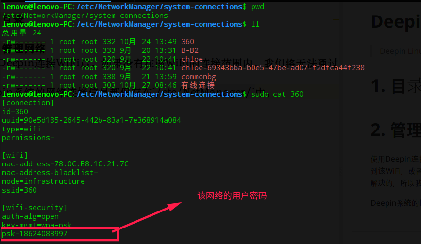

# Deepin（深度）系统使用总结
> Deepin Linux

# 1. 目录

1. [管理网络](#menuNetworkManager)
2. [更新字体](#menuUpdateFonts)


# <a name="menuNetworkManager" /> 2\. 管理网络

使用Deepin连接WiFi后，如果没有在该WiFi的连接范围内，我们将无法通过控制面板中的WiFi功能区查看到该WiFi，或者我们需要查看我们所连接WiFi的密码，这些问题在目前我们是无法通过官方提供的桌面程序解决的，所以我们需要深挖Deepin系统，将我们需要的内容挖掘出来。

Deepin系统的网络连接信息都保存在`/etc/NetworkManager/system-connections/`中，如下图。



# <a name="menuUpdateFonts" /> 3\. 更新字体

1. 创建字体文件夹，可以从Windows系统中复制（`[系统盘盘符]:/windows/fonts/`）
```
sudo mkdir -p /usr/share/fonts/myfonts
```

2. 添加字体到该文件夹
```
cp [source path] /usr/share/fonts/fonts/myfonts
```

3. 赋予字体文件可读权限
```
sudo chmod -R 666 /usr/share/fonts/myfonts/
```

4. 更新字体文件
```
cd /usr/share/fonts/myfonts
sudo mkfontscale
sudo mkfontdir
sudo fc-cache -fv
```

**注意**：可能需重新启动才能使修改生效。
