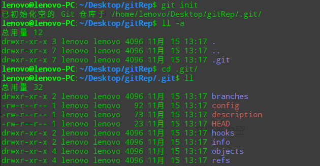

# Git 复习笔记

# 1. Git安装
这部分内容实在是没有什么需要讲的，所以...

# 2. Git的基本使用

## 2.1 设置开发者个人信息
Git是分布式版本控制系统，所以，每个机器都填写自己的基本信息：开发者姓名、Email地址。
* 姓名：`git config --global user.name "gengyuntuo"`
* Email：`git config --global user.email "gengyuntuo@163.com"`
* 查询全局信息：`git config -l`

# 2.2 创建仓库（版本库）

### 2.2.1 初始化仓库：`git init`
在某一个目录下运行`git init`就会在当前目录下创建版本库，而且该目录下会生成一个`.git`的文件夹，这个文件夹中的信息就是版本库的信息。

### 2.2.2 查看仓库状态：`git status`
在“git status”状态查询操作上，可以发现有如下几个提示信息：
* 现在的开发所在的分支（On branch master）
* 初始化仓库的提交（Initial commit）
* 未标记的文件：（Untracked files）
* 一些操作命令提示
* 未标记文件的列表

### 2.2.3 添加文件到仓库：`git add [file]`、`git commit -m "comment"`

