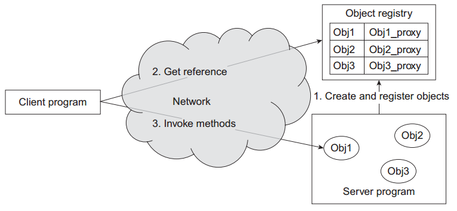
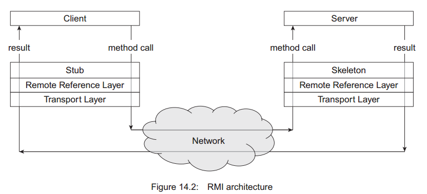
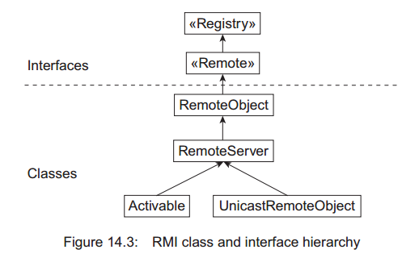
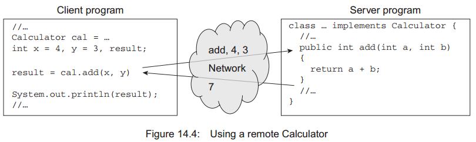
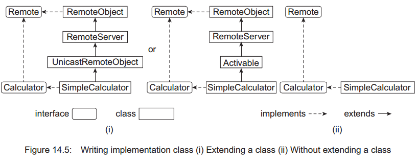

# Java RMI
> 主要内容  
> * 了解 RPC（**R**emote **P**rocedure **C**all）
> * 理解RMI的架构和不同组件
> * 了解编写RMI应用的基本步骤
> * 使用RMI编写分布式应用
> * 了解什么是动态对象激活（dynamic object activation）
> * 了解回调机制的核心
> * 了解动态class加载工作

# 1、 介绍
目前使用socket概念开发的应用为网络程序。尽管socket提供一种简单的方式去编写网络应用，但它既不是最方便也不是最强大的。因为都要以字节流的方式通过网络传输。虽然Java提供了一系列接口和类来完成这件事，但使用这些工具编写一个复杂应用毫无疑问是不容易的。

意识到这些因素后，以后的Java版本中，一种针对网络新的面向对象版本出现（即RMI）。这种技术将网络编程提升到一个新高度。在这章，我们将探索为什么这种机制能够轻易的开发复杂的网络应用。

# 2、远程方法调用（Remote Method Invocation， 即RMI）
Java 远程方法调用（RMI）是一种面向对象的远程过程调用（Remote Procedure Call，即RPC）技术。它允许我们调用在不同地址空间上对象的方法。这里的地址空间可能在相同计算机也可能在通过网络连接的不同计算机。因此，分布的计算机之间上的对象可以相互通讯。编程模型如下：  


该模型中客户端和服务端之间的底层通讯是通过socket实现。这意味着来自客户端消息不是面向对象的方法调用。而是
在执行目标方法前解析数据流。然而，RMI应用开发者不需要知道这些复杂socket通讯。一般来说，RMI架构开发需要考虑下面两个目标：
* RMI的主要目标是允许开发者使用与非分布式程序相同的语法、语义开发分布式应用。
* 另一个目标是创建适合Java编程语言和类本地对象模型的分布式对象模型。RMI架构最终成功创建出具有安全性、容错性的Java架构分布计算系统。

## 2.1 应用组件
在上图中可以看到RMI应用中的三个实体：Server、Client和object registry。

**Server**  
这是一个创建执行方法调用的远程对象的程序。这是一个实现Java RMI接口的普通对象。当被创建后，该对象将被输出并注册到一个叫做object registry的应用。

**Client**  
Client应用使用特殊的名称从object registry中获取一个远程对象的引用。使用这个引用就可以像在调用本地方法一样调用远程对象的方法。client和server之间的具体通讯细节由RMI完成。注意，client和server之间复杂的通讯过程是完全透明的。

**Object Registry**  
它是重要的对象表。表中的每条记录是对象名称到它的代理存根。Server用对象名称将对象存根注册到object registry。一旦成功将对象存根注册到object registry，那么这个对象就可以被其它对象调用。Client可以从registry获取远程对象的引用并调用远程对象的方法。

## 2.2 基本步骤
开发运行RMI应用包含如下几步：
* 定义远程接口
* 实现远程接口
* 在server程序中创建、导出和注册远程对象
* 在client程序中获取远程对象的引用
* 编译Java源文件
* 运行应用

**定义远程接口**  
首先，和们在接口中定义希望在server发布的方法。因为运程对象调用不同于本地方法调用，所以远程对象接口必须申明如下内容：
* 远程接口必须是public的
* 远程接口必须继承`java.rmi.Remote`接口（直接继承或间接继承）。Remote接口是一个标记接口，没有方法。
  ```
  public interface java.rmi.Remote{}
  ```
  远程接口实现Remote接口仅仅是为了标识方法将被远程调用。
* 接口中的每个方法必须显式声明抛出`java.rmi.RemoteException`。远程对象调用相对于本地对象调用有着更多的失败原因，因此，每个方法抛出RemoteException异常可以有利于异常的成功处理。

**实现远程接口**  
当我们编写具体的类时会实现一个或多个远程接口，这些类也可能会实现其它接口或添加其它只能在本地调用的方法。所有被这些方法使用的参数或返回值的类型也必须实现。对于实现了不止一个远程接口类，调用者不需要负责底层实现。

**实现server**  
实现server应用具体内容是创建远程对象并注册它到RMI registry（这一过程也被称为对象发布）。注册对象到RMI registry有多种方法，本章后续部分会依次介绍。

**实现Client**  
client程序获取远程对象并执行远程对象的方法。同样也有不同的方式去获取远程对象的引用，本章后面会详细讨论。

**编译**  
使用Java编译器（javac）去编译所有源码文件，包括接口文件和附属的类。为了保证RMI正常工作，我们还需要来自stub、skeleton的帮助。请注意Java5.0之前的版本必须使用
rmic编译生成RMI stub，5.0及5.0之后的版本不再需要这一步。无论如何，方法的stub和skeleton如下所述：
* 当client调用远程方法，一个简单方法调用在本地stub发生
* stub封装必要的信息（方法名、参数等）并发送到server端的skeleton。在网络传输前，收集数据然后转换成标准格式这一过程被称为marshalling。stub知道skeleton的所有信息（IP地址、端口）
* 一旦收到消息，server端的skeleton解析（un-marshals）信息然后在对应的对象上调用方法。将marshalled的信息解析这一过程称为un-marshals。最后，它将结果打包发送给stub。
* stub将结果解包并返回给client。

**启动应用**  
首先，启动object registry。在Java中，使用rmiregistry启动object registry。它也可以被动态创建。接着启动server程序。最后，启动client程序。  


# 3. Java RMI 接口和类
Java RMI远程调用框架在包`java.rmi`中提供。应用开发者使用该包去创建应用。Java RMI几乎隐藏了分布式的所有细节，同时还提供了统一的方式去访问所有对象（分布或非分布的）。主要类和接口的继承结构如下图所示：  


# 4. 开发一个应用
在本节，我们将使用Java RMI技术开发一个简单但优雅的分布式应用。在本应用中（图14.4）中，服务端程序创建并提供一个仅包含一个方法的简单远程对象（我们称之为 计算器）。 这个方法用两个整数作为参数并返回它们的和。客户端程序获取远程对象的引用并调用这个方法计算两个整数的和。  


## 4.1 编写接口
首先，通讯程序必须达成协议。协议用接口表达且通常由service提供。接口是对那些实现该接口方法的抽象描述。为了支持接口，对象必须提供对这些方法的实现。

接口仅仅是未实现方法的抽象描述（签名）。签名提供必要的信息，例如：方法名、返回值和参数的数量、顺序与类型。这意味着签名提供足够的信息去定义方法调用方法的语法。一个程序（称作server程序/service程序）创建一个实现了这些接口的对象并发布这些接口。发布这些接口，server程序传送这些消息：  
“大家好，我创建了一个可以提供一系列重要服务的对象。如果你们感兴趣，你可以调用该对象上对应的方法来获取这些服务。调用时需要的必要信息（方法名、参数列表和返回值）在接口中给出”。

因为方法调用发生在远程对象上，不同于本地方法调用，所以远程对象的接口必须满足如下条件：
* 远程接口必须是public。
* 远程接口（直接或间接）继承`java.rmi.Remote`接口。Remote接口是标记接口，没有方法定义。
* 接口中的每个方法必须显式声明抛出`java.rmi.RemoteException`。远程对象调用相对于本地对象调用有着更多的失败原因，因此，每个方法抛出RemoteException异常可以有利于异常的成功处理。

在我们的应用中，远程对象提供一个如下方法：
* 有两个Integer类型的参数，将它们相加并返回结果

根据上面的描述定义如下接口：
```java
// Calculator.java
import java.rmi.*;
public interface Calculator extends Remote {
public int add(int a, int b) throws RemoteException;
}
```
Calculator接口定义远程对象在client端的视图。程序通过接口了解提供者的方法信息。通过这种方式，Calculator接口帮助client和server之间相互达成协议。

Calculator接口因继承Remote接口而成为远程接口，任何实现了Calculator接口的对象方法都可以从不同的JVM中调用。

Calculator接口仅仅描述了一个`add()`方法，远程程序可以使用这个方法计算两个整数的和。因为是远程调用，调用可能由于通讯、协议或server等问题而调用失败，所以方法需要显式抛出RemoteException。RemoteException异常是一个经检查的异常，所以，调用该方法的程序必须明确地处理这个异常。

一个远程接口必须是public的。远程接口很可能被非同本包的对象调用。我们知道一个非public修饰的接口仅能被本包下的类访问。因此，为了让每个对象都可以访问，它需要被声明为public，我们的Calculator接口声明为public的。

在RMI中Java对象传输过程中用到了序列化。因此，在不同JVM之间相互传输的变量|/对象必须是可序列化的。可序列化的对象实现了`java.io.Serializable`接口。`java.io.Serializable`接口中没有定义任何内容，它仅仅说明对象可以被序列化。在我们的应用中，client调用add()方法传输两个整数类型参数。幸运的是，int类型和全部的原始类型都是可序列化的。因此不需要担心序列化过程。

## 4.2 编写实现类
一个接口仅仅帮助我们定义方法语法。它不提供任何方法实现（方法体）。实现在其它类中提供。一般的，远程对象实现类按照如下规范开发：
* 必须声明至少一个远程接口
* 必须实现所有远程接口中定义的方法
* 选择性的定义一个或者多个方法

### 4.2.1 实现远程接口
编写实现类（在我们的应用中叫做SimpleCalculator）有两种方式。最简单的方式是实现类继承`java.rmi.server.UnicastRemoteObject`或`java.rmi.PortableRemoteObject`类（如图14.5），在这个例子中，实现类将成为远程类。这种模式的优势是通过超类的构造函数（UnicastRemoteObject或PortableRemoteObject）可以在类创建的时候自动注册，因此，我们不需要显式的注册。然而这种模式的问题是因为Java不支持多重继承所以实现类不能根据将来的业务需求去继承其它的类。因此，通过继承UnicastRemoteObject或PortableRemoteObject去实现远程对象的文法是不推荐的。



为了避免上述的问题，有另一种更好的模式。这种模式中实现类不需要继承UnicastRemoteObject或PortableRemoteObject，从而支持根据后续的需要进行扩展，如图15.5 ii。然而实现类必须被显式注册，幸运的是，UnicastRemoteObjec和Activatable中都提供了多个重载版本的静态方法`exportObject()`来显式注册远程对象。在本例中，尽管我们写了一些额外的代码，我们还是保留对其它类继承能力以便将来在需要的时候继承其它的类。

在我们的实现类中，实现如下：
```java
//SimpleCalculator.java
import java.rmi.*;
public class SimpleCalculator implements Calculator {
    public int add(int a, int b) {
        System.out.println("Received: " + a + "and" + b);
        int result = a + b;
        System.out.println("Sent: " + result);
        return result;
    }
}
```

### 4.2.2 提供方法实现
实现类必须提供所有远程接口中定义的方法。我们的实现类SimpleCalculator仅有`add()`方法，定义如下：
```
public int add(int a, int b) {
    System.out.println("Received: " + a + "and" + b);
    int result = a + b;
    System.out.println("Sent: " + result);
    return result;
}
```
`add()`方法的实现是很简单的。它将传入两个整型参数并返回它们的和。`System.out.println()`方法用来显示有用的信息来方便我们追踪方法调用。

`add()`方法没有必要必须显式抛出异常，因为方法体本身既没有RemoteException异常也没有其它经检查的异常抛出。

当一个类申明实现了一个接口，那么就相当于向编译器承诺实现了接口中方法的方法体。我们知道接口中的方法被声明为public和abstract。因此，如果实现类没有遵守这个承诺（没有提供所有方法的定义0），那么它就是一个不完整的类，根据定义这个类应该称为抽象类。在本例中，编译器会自动判断出实现类没有被声明为抽象类。

在实现类中，很有可能定义非远程接口中声明的方法。这类方法仅能在本地执行而不能够远程执行。

参数、返回值的类型可能是任何一种有效的Java类型，包括对象。针对对象，需要实现`java.io.Serializable`接口。好在`java.lang`包和`java.util`包下几乎所有的类都实现了Serializable接口。然而那些没有实现Serializable接口的类是无法作为远程方法的参数或者返回值类型的。例如相关的线程类、文件描述符、Socket连接、数据库连接等那些地址空间中的对象。

当对象被传送给远程方法时需要遵守如下规则。

当本地对象作为传送给远程方法的参数时，方法的实际参数是本地对象引用的临时副本。因此，如果一个远程方法通过实际参数调用方法，方法调用发生在本地对象而不是被传递给远程的参数对象。本地对象在远程方法中的所有状态改变都会传送给本地对象。需要注意的是，远程JVM中必须存在实际对象的定义。

然而，如果传递给远程方法的对象是一个远程对象，方法的实际参数是本地对实际对象的代理的引用。在这个案例中，实际参数的方法调用结果和本地代理对象方法调用的结果相似。本章后面部分会给出详细介绍。

### 4.2.3 编写构造器
如果实现类没有继承`java.rmi.server.UnicastRemoteObject`或`java.rmi.PortableRemoteObject`类编写构造函数就不是强制性的。然而如果实现类继承了`java.rmi.server.UnicastRemoteObject`或`java.rmi.PortableRemoteObject`类中的一个或两个，就必须编写构造器，原因如下：

如果实现类继承`java.rmi.server.UnicastRemoteObject`或`java.rmi.PortableRemoteObject`类，实现类对象会被超类的构造器自动注册。因此，在注册期间可能会抛出`java.rmi.RemoteException`异常，所以我们定义一个可以抛出`java.rmi.RemoteException`异常的构造器，即使可靠器什么都不做。否则Java编译器会产生错误信息。

因为我们的实现类实现类没有继承这两个类，所以我们不需要编写构造器。然而你可能编写一个构造器来初始化新创建实例的变量。

## 4.3 编写RMI Server
这是一个简单的Java应用（叫做CalculatorServer.java），它包含我们熟知的`main()`方法。程序通常按照如下步骤运行：
* 创建实现类的实例
* 导出自己以便于对象可以接收远程客户端的调用
* 注册对象到注册中心以便于远程客户端可以获取对象的引用

### 4.3.1 创建远程对象
使用创建普通类的语法创建实现类的实例。
```
SimpleCalculator calculator = new SimpleCalculator();
```

### 4.3.2 注册对象


### 4.3.3 注册stub

## 4.4 编写RMI Client

# 5 编译程序

## 5.1 编译Server

## 5.2 编译Client

# 6 生成stub类

# 7 运行程序

## 7.1 启动Server

## 7.2 启动Client

## 7.3 理解object Registry

## 7.4 使用RMI URL

# 8 回调

## 8.1 创建接口

## 8.2 实现接口

## 8.3 编写Server

## 8.4 编写Client

## 8.5 编译应用

## 8.6 运行应用

# 9 另一种回调应用

# 10 动态对象激活

## 10.1 基本观点

## 10.2 实现

## 10.3 激活协议

## 10.4 举例

### 10.4.1 编写实现类

### 10.4.2 编写Server类

### 10.4.3 编译并运行

# 11 动态类下载

# 12 举例

## 12.1 编写RMI Server

### 12.1.1 编写接口

### 12.1.2 实现接口

### 12.1.3 实现Server

## 12.2 编写Client

## 12.3 编译程序

### 12.3.1 创建接口类

### 12.3.2 编译Server

### 12.3.3 编译Client

### 12.3.4 运行应用

## 12.5 启动Client


