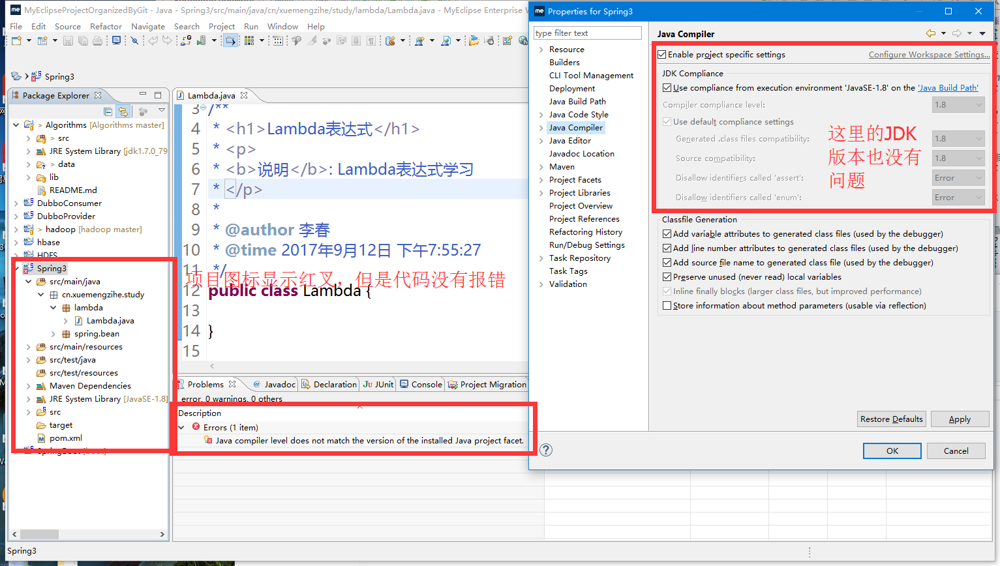
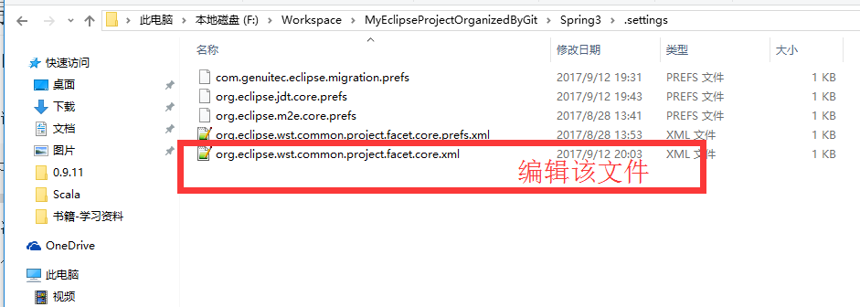
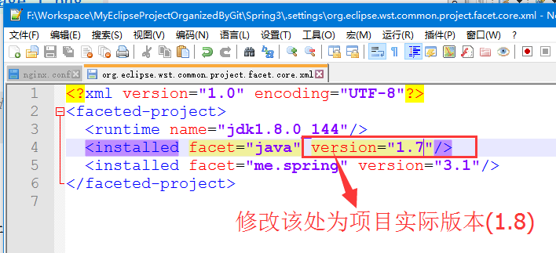

# MyEclipse 导入项目报错
>

## 导入项目后，项目图标显示红叉
项目如下：



错误提示：
```
Java compiler level does not match the version of the installed Java project facet.	Spring3		Unknown	Faceted Project Problem (Java Version Mismatch)

```

解决方案：
1. 打开项目目录，打开其中的`.settings`目录,如图。



2. 修改配置文件`org.eclipse.wst.common.project.facet.core.xml`，如下。



3. 然后刷新项目