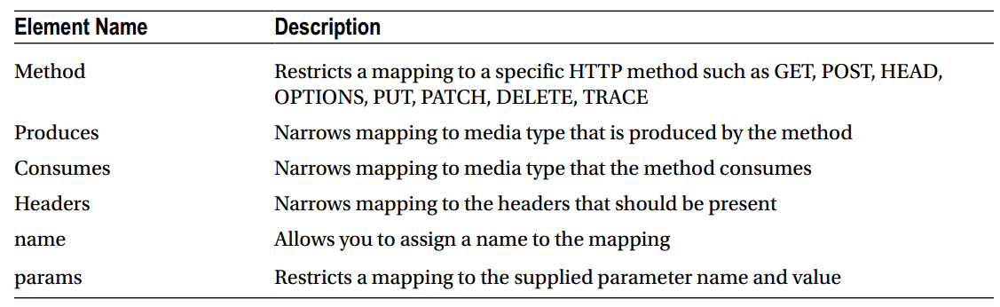

# REST ful及在Spring中的实现
>

## REST

客户端`Accept`头请求一种特定格式的表述，服务端则通过`Content-Type`告诉客户端资源的表述形式


## HTTP
* HTTP方法

| 方法名 | 安全 | 幂等性 |
|:---:|:---:|:---:|
|GET |T |T |
|HEAD |T |T |
|DELETE |F |T |
|PUT |F |T |
|POST |F |F |
|PATCH |F |F|

* HTTP动词和CRUD操作

| 方法名 | CRUD | 
|:---:|:---:|
|GET |Read |
|DELETE |Delete |
|PUT |Update |
|POST |Create |

* HTTP状态码

## Spring MVC
* `@RequestMapping`注解：它用来映射Web请求到一个处理类或处理方法。它提供一些属性可以缩小映射范围，如下表所示：



* `@PathVariable`注解：位置参数
```
    @RequestMapping("/users/{username}")
    public User getUser(@PathVariable("username") String username) {
        User user = null;
        // Code to construct user object using username
        return user;
    }
```

## Spring MVC实现REST_ful
* GET动词
```
@RequestMapping(value="/polls", method=RequestMethod.GET)
public ResponseEntity<Iterable<Poll>> getAllPolls() {
    Iterable<Poll> allPolls = pollRepository.findAll();
    return new ResponseEntity<>(pollRepository.findAll(), HttpStatus.OK);
}
```
```
@RequestMapping(value="/polls/{pollId}", method=RequestMethod.GET)
public ResponseEntity<?> getPoll(@PathVariable Long pollId) {
    Poll p = pollRepository.findOne(pollId);
    return new ResponseEntity<> (p, HttpStatus.OK);
}
```

* POST动词
```
@RequestMapping(value="/polls", method=RequestMethod.POST)
public ResponseEntity<?> createPoll(@RequestBody Poll poll) {
    poll = pollRepository.save(poll);
    return new ResponseEntity<>(null, HttpStatus.CREATED);
}
```

尽管上面的请求可以让我们创建一个新的Poll，但是如果我们的客户端需要获取这个新创建的Poll对象，当前的这种实现不能满足需要
因为我们需要将新创建的Poll对象的URI通过HTTP头传给客户端。绑定这个URI我们需要从HttpServletRequest对象中获取诸如根URI和
上下文。Spring中的`ServletUriComponentsBuilder工具类可以让我们很轻易的实现这些工作。
```
@RequestMapping(value="/polls", method=RequestMethod.POST)
public ResponseEntity<?> createPoll(@RequestBody Poll poll) {
    poll = pollRepository.save(poll);
    // Set the location header for the newly created resource
    HttpHeaders responseHeaders = new HttpHeaders();
    URI newPollUri = ServletUriComponentsBuilder
                .fromCurrentRequest() // 从HttpServletRequest中获取诸如主机、schema、端口等信息
                .path("/{id}")        // 设置位置变量
                .buildAndExpand(poll.getId()) // 设置位置变量的值
                .toUri(); // 生成最终的URI
    responseHeaders.setLocation(newPollUri);
    return new ResponseEntity<>(null, responseHeaders, HttpStatus.CREATED);
}
```

* PUT动词
```
@RequestMapping(value="/polls/{pollId}", method=RequestMethod.PUT)
public ResponseEntity<?> updatePoll(@RequestBody Poll poll, @PathVariable Long pollId) {
    // Save the entity
    Poll p = pollRepository.save(poll);
    return new ResponseEntity<>(HttpStatus.OK);
}
```

* DELETE动词
```
@RequestMapping(value="/polls/{pollId}", method=RequestMethod.DELETE)
public ResponseEntity<?> deletePoll(@PathVariable Long pollId) {
    pollRepository.delete(pollId);
    return new ResponseEntity<>(HttpStatus.OK);
}
```

## 异常处理
1. `@ControllerAdvice`：在SpringBoot中，可以实现切面。
2. `@ExceptionHandler`：处理` ResourceNotFoundException`异常
```
@ControllerAdvice
public class RestExceptionHandler {
@ExceptionHandler(ResourceNotFoundException.class)
public ResponseEntity<?> handleResourceNotFoundException(ResourceNotFoundException rnfe, HttpServletRequest request) {
    ErrorDetail errorDetail = new ErrorDetail();
    errorDetail.setTimeStamp(new Date().getTime());
    errorDetail.setStatus(HttpStatus.NOT_FOUND.value());
    errorDetail.setTitle("Resource Not Found");
    errorDetail.setDetail(rnfe.getMessage());
    errorDetail.setDeveloperMessage(rnfe.getClass().getName());
    return new ResponseEntity<>(errorDetail, null, HttpStatus.NOT_FOUND);
    }
}
```

## 输入校验
Spring MVC中两种用户输入校验方式：
1. 通过实现Validator接口实现校验器，然后注入到Controller中，手动校验
2. 使用JSR303 校验，它是一个旨在简化应用层字段校验的API


